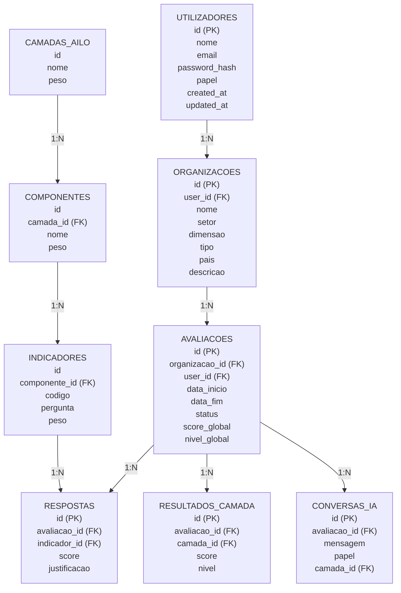
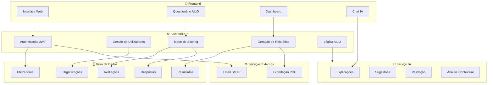
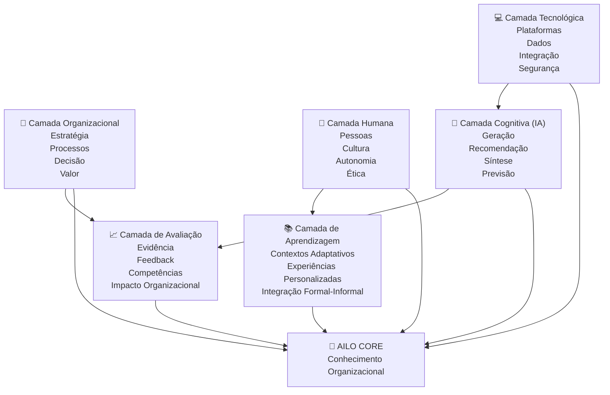

# Modelo de Dados — Esquema Relacional AILO

## 1. Diagrama Entidade-Relacionamento (Textual)

---

## 2. Esquema SQL (SQLite/PostgreSQL)

---

## 3. Dados Iniciais (Seed Data)

### 3.1. Camadas AILO

### 3.2. Componentes (exemplo — Camada Organizacional)

```mermaid
flowchart TB

O["🏢 Organizacional"]

OE["Estratégia"]
OP["Processos"]
OD["Decisão"]
OV["Valor"]

H["👥 Humana"]

HP["Pessoas"]
HC["Cultura"]
HA["Autonomia"]
HE["Ética"]

A["📚 Aprendizagem"]

AC["Contextos Adaptativos"]
AE["Experiências Personalizadas"]
AI["Integração Formal-Informal"]

C["🤖 Cognitiva (IA)"]

CG["Geração"]
CR["Recomendação"]
CS["Síntese"]
CP["Previsão"]

T["💻 Tecnológica"]

TP["Plataformas"]
TD["Dados"]
TI["Integração"]
TS["Segurança"]

V["📈 Avaliação"]

VE["Evidência"]
VF["Avaliação Formativa"]
VC["Competências"]
VI["Impacto Organizacional"]

O --> OE
O --> OP
O --> OD
O --> OV

H --> HP
H --> HC
H --> HA
H --> HE

A --> AC
A --> AE
A --> AI

C --> CG
C --> CR
C --> CS
C --> CP

T --> TP
T --> TD
T --> TI
T --> TS

V --> VE
V --> VF
V --> VC
V --> VI
```

> Os seeds completos para todas as 6 camadas, 23 componentes e 51 indicadores estão definidos no ficheiro `02_indicadores_por_camada.md` e serão implementados na Fase 2.

---

## 4. Relações e Cardinalidades

| Relação | Cardinalidade | Descrição |
|---------|---------------|-----------|
| utilizadores → organizacoes | 1:N | Um utilizador pode ter múltiplas organizações |
| organizacoes → avaliacoes | 1:N | Uma organização pode ter múltiplas avaliações |
| avaliacoes → respostas | 1:N | Uma avaliação tem múltiplas respostas (1 por indicador) |
| camadas_ailo → componentes | 1:N | Cada camada tem múltiplos componentes |
| componentes → indicadores | 1:N | Cada componente tem múltiplos indicadores |
| avaliacoes → resultados_camada | 1:N | Uma avaliação tem 6 resultados (1 por camada) |
| avaliacoes → interdependencias | 1:N | Uma avaliação tem múltiplas análises de interdependência |
| avaliacoes → conversas_ia | 1:N | Uma avaliação tem múltiplas mensagens de chat |
| avaliacoes → recomendacoes | 1:N | Uma avaliação gera múltiplas recomendações |
| avaliacoes → relatorios | 1:1 | Uma avaliação gera um relatório |
