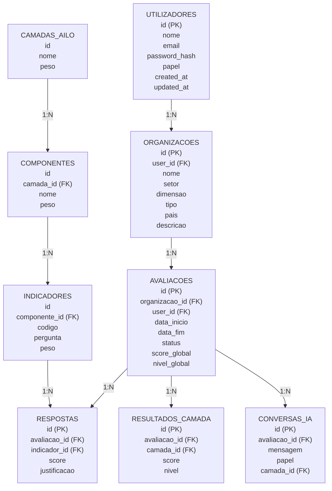

# Modelo de Dados — Esquema Relacional AILO

## 1. Diagrama Entidade-Relacionamento (Textual)



---

## 2. Esquema SQL (SQLite/PostgreSQL)

```sql
-- ══════════════════════════════════════════════════════════
-- UTILIZADORES
-- ══════════════════════════════════════════════════════════
CREATE TABLE utilizadores (
    id              INTEGER PRIMARY KEY AUTOINCREMENT,
    nome            TEXT NOT NULL,
    email           TEXT NOT NULL UNIQUE,
    password_hash   TEXT NOT NULL,
    papel           TEXT NOT NULL DEFAULT 'utilizador' CHECK(papel IN ('utilizador', 'admin')),
    ativo           BOOLEAN DEFAULT 1,
    created_at      TIMESTAMP DEFAULT CURRENT_TIMESTAMP,
    updated_at      TIMESTAMP DEFAULT CURRENT_TIMESTAMP
);

-- ══════════════════════════════════════════════════════════
-- ORGANIZAÇÕES
-- ══════════════════════════════════════════════════════════
CREATE TABLE organizacoes (
    id              INTEGER PRIMARY KEY AUTOINCREMENT,
    user_id         INTEGER NOT NULL REFERENCES utilizadores(id),
    nome            TEXT NOT NULL,
    setor           TEXT NOT NULL,              -- ex: 'Educação', 'Retalho', 'Tecnologia', 'Saúde'
    dimensao        TEXT NOT NULL,              -- 'micro', 'pequena', 'media', 'grande'
    tipo            TEXT NOT NULL,              -- 'mpe', 'pme', 'grande_empresa', 'ensino_superior'
    pais            TEXT DEFAULT 'Portugal',
    descricao       TEXT,
    created_at      TIMESTAMP DEFAULT CURRENT_TIMESTAMP,
    updated_at      TIMESTAMP DEFAULT CURRENT_TIMESTAMP
);

-- ══════════════════════════════════════════════════════════
-- FRAMEWORK AILO — CAMADAS
-- ══════════════════════════════════════════════════════════
CREATE TABLE camadas_ailo (
    id              INTEGER PRIMARY KEY AUTOINCREMENT,
    nome            TEXT NOT NULL,               -- 'Organizacional', 'Humana', etc.
    nome_en         TEXT NOT NULL,               -- 'Organizational', 'Human', etc.
    descricao       TEXT NOT NULL,
    peso            REAL NOT NULL DEFAULT 1.0,   -- Peso no cálculo global
    ordem           INTEGER NOT NULL,            -- Posição no questionário (1-6)
    cor             TEXT DEFAULT '#2E4057',       -- Cor no dashboard hexagonal
    icone           TEXT                          -- Nome do ícone
);

-- ══════════════════════════════════════════════════════════
-- COMPONENTES (sub-elementos de cada camada)
-- ══════════════════════════════════════════════════════════
CREATE TABLE componentes (
    id              INTEGER PRIMARY KEY AUTOINCREMENT,
    camada_id       INTEGER NOT NULL REFERENCES camadas_ailo(id),
    nome            TEXT NOT NULL,               -- 'Estratégia', 'Pessoas', etc.
    nome_en         TEXT NOT NULL,
    descricao       TEXT,
    peso            REAL NOT NULL DEFAULT 1.0,
    ordem           INTEGER NOT NULL
);

-- ══════════════════════════════════════════════════════════
-- INDICADORES (perguntas do questionário)
-- ══════════════════════════════════════════════════════════
CREATE TABLE indicadores (
    id              INTEGER PRIMARY KEY AUTOINCREMENT,
    componente_id   INTEGER NOT NULL REFERENCES componentes(id),
    codigo          TEXT NOT NULL UNIQUE,         -- 'O.E.1', 'H.P.1', etc.
    pergunta        TEXT NOT NULL,                -- Texto da pergunta no questionário
    descricao       TEXT,                         -- Explicação expandida do indicador
    desc_nivel_1    TEXT NOT NULL,                -- Descrição do nível 1 (Inicial)
    desc_nivel_2    TEXT,                         -- Descrição do nível 2
    desc_nivel_3    TEXT NOT NULL,                -- Descrição do nível 3 (Definido)
    desc_nivel_4    TEXT,                         -- Descrição do nível 4
    desc_nivel_5    TEXT NOT NULL,                -- Descrição do nível 5 (Otimizado)
    peso            REAL NOT NULL DEFAULT 1.0,
    obrigatorio     BOOLEAN DEFAULT 1,
    condicao        TEXT,                         -- Condição para mostrar (JSON: {"campo": "tipo", "valor": "ensino_superior"})
    ordem           INTEGER NOT NULL
);

-- ══════════════════════════════════════════════════════════
-- AVALIAÇÕES (instâncias de diagnóstico)
-- ══════════════════════════════════════════════════════════
CREATE TABLE avaliacoes (
    id              INTEGER PRIMARY KEY AUTOINCREMENT,
    organizacao_id  INTEGER NOT NULL REFERENCES organizacoes(id),
    user_id         INTEGER NOT NULL REFERENCES utilizadores(id),
    data_inicio     TIMESTAMP DEFAULT CURRENT_TIMESTAMP,
    data_fim        TIMESTAMP,
    status          TEXT NOT NULL DEFAULT 'em_curso' CHECK(status IN ('em_curso', 'completa', 'cancelada')),
    score_global    REAL,                        -- Calculado ao finalizar
    nivel_global    TEXT,                         -- 'Inicial', 'Em Desenvolvimento', etc.
    notas           TEXT,
    created_at      TIMESTAMP DEFAULT CURRENT_TIMESTAMP
);

-- ══════════════════════════════════════════════════════════
-- RESPOSTAS (uma por indicador por avaliação)
-- ══════════════════════════════════════════════════════════
CREATE TABLE respostas (
    id              INTEGER PRIMARY KEY AUTOINCREMENT,
    avaliacao_id    INTEGER NOT NULL REFERENCES avaliacoes(id),
    indicador_id    INTEGER NOT NULL REFERENCES indicadores(id),
    score           INTEGER NOT NULL CHECK(score BETWEEN 1 AND 5),
    justificacao    TEXT,                         -- Texto livre opcional do utilizador
    created_at      TIMESTAMP DEFAULT CURRENT_TIMESTAMP,
    updated_at      TIMESTAMP DEFAULT CURRENT_TIMESTAMP,
    UNIQUE(avaliacao_id, indicador_id)
);

-- ══════════════════════════════════════════════════════════
-- RESULTADOS POR CAMADA (calculados pelo motor de scoring)
-- ══════════════════════════════════════════════════════════
CREATE TABLE resultados_camada (
    id              INTEGER PRIMARY KEY AUTOINCREMENT,
    avaliacao_id    INTEGER NOT NULL REFERENCES avaliacoes(id),
    camada_id       INTEGER NOT NULL REFERENCES camadas_ailo(id),
    score           REAL NOT NULL,               -- Score calculado (1.0-5.0)
    nivel           TEXT NOT NULL,                -- Nível de maturidade
    pontos_fortes   TEXT,                         -- JSON array de pontos fortes
    lacunas         TEXT,                         -- JSON array de lacunas
    recomendacoes   TEXT,                         -- JSON array de recomendações
    cr_mapeamento   TEXT,                         -- JSON: CRs relevantes para esta camada
    UNIQUE(avaliacao_id, camada_id)
);

-- ══════════════════════════════════════════════════════════
-- INTERDEPENDÊNCIAS ENTRE CAMADAS
-- ══════════════════════════════════════════════════════════
CREATE TABLE interdependencias (
    id              INTEGER PRIMARY KEY AUTOINCREMENT,
    avaliacao_id    INTEGER NOT NULL REFERENCES avaliacoes(id),
    camada_a_id     INTEGER NOT NULL REFERENCES camadas_ailo(id),
    camada_b_id     INTEGER NOT NULL REFERENCES camadas_ailo(id),
    tipo_relacao    TEXT NOT NULL,                -- 'fortalece', 'bloqueia', 'risco', 'oportunidade'
    descricao       TEXT NOT NULL,
    impacto         TEXT NOT NULL CHECK(impacto IN ('alto', 'medio', 'baixo')),
    created_at      TIMESTAMP DEFAULT CURRENT_TIMESTAMP
);

-- ══════════════════════════════════════════════════════════
-- CATÁLOGO DE FERRAMENTAS IA
-- ══════════════════════════════════════════════════════════
CREATE TABLE ferramentas_ia (
    id              INTEGER PRIMARY KEY AUTOINCREMENT,
    nome            TEXT NOT NULL,
    descricao       TEXT NOT NULL,
    camada_id       INTEGER REFERENCES camadas_ailo(id),  -- Camada AILO principal
    area_funcional  TEXT NOT NULL,                -- 'aprendizagem', 'analytics', 'automacao', 'comunicacao'
    custo           TEXT NOT NULL CHECK(custo IN ('gratuito', 'freemium', 'pago')),
    complexidade    TEXT NOT NULL CHECK(complexidade IN ('baixa', 'media', 'alta')),
    url             TEXT,
    ativo           BOOLEAN DEFAULT 1,
    created_at      TIMESTAMP DEFAULT CURRENT_TIMESTAMP
);

-- ══════════════════════════════════════════════════════════
-- RECOMENDAÇÕES (ferramentas recomendadas por avaliação)
-- ══════════════════════════════════════════════════════════
CREATE TABLE recomendacoes (
    id              INTEGER PRIMARY KEY AUTOINCREMENT,
    avaliacao_id    INTEGER NOT NULL REFERENCES avaliacoes(id),
    ferramenta_id   INTEGER NOT NULL REFERENCES ferramentas_ia(id),
    camada_id       INTEGER NOT NULL REFERENCES camadas_ailo(id),
    prioridade      INTEGER NOT NULL DEFAULT 1,   -- 1=mais prioritário
    justificacao    TEXT,
    created_at      TIMESTAMP DEFAULT CURRENT_TIMESTAMP
);

-- ══════════════════════════════════════════════════════════
-- RELATÓRIOS GERADOS
-- ══════════════════════════════════════════════════════════
CREATE TABLE relatorios (
    id              INTEGER PRIMARY KEY AUTOINCREMENT,
    avaliacao_id    INTEGER NOT NULL REFERENCES avaliacoes(id) UNIQUE,
    titulo          TEXT NOT NULL,
    conteudo_json   TEXT NOT NULL,                -- JSON com dados estruturados do relatório
    pdf_path        TEXT,                         -- Caminho para ficheiro PDF gerado
    created_at      TIMESTAMP DEFAULT CURRENT_TIMESTAMP
);

-- ══════════════════════════════════════════════════════════
-- CONVERSAS COM ASSISTENTE IA
-- ══════════════════════════════════════════════════════════
CREATE TABLE conversas_ia (
    id              INTEGER PRIMARY KEY AUTOINCREMENT,
    avaliacao_id    INTEGER NOT NULL REFERENCES avaliacoes(id),
    papel           TEXT NOT NULL CHECK(papel IN ('user', 'assistant', 'system')),
    mensagem        TEXT NOT NULL,
    camada_id       INTEGER REFERENCES camadas_ailo(id),  -- Contexto da camada (se aplicável)
    created_at      TIMESTAMP DEFAULT CURRENT_TIMESTAMP
);

-- ══════════════════════════════════════════════════════════
-- ÍNDICES
-- ══════════════════════════════════════════════════════════
CREATE INDEX idx_organizacoes_user ON organizacoes(user_id);
CREATE INDEX idx_avaliacoes_org ON avaliacoes(organizacao_id);
CREATE INDEX idx_avaliacoes_user ON avaliacoes(user_id);
CREATE INDEX idx_respostas_avaliacao ON respostas(avaliacao_id);
CREATE INDEX idx_respostas_indicador ON respostas(indicador_id);
CREATE INDEX idx_componentes_camada ON componentes(camada_id);
CREATE INDEX idx_indicadores_componente ON indicadores(componente_id);
CREATE INDEX idx_resultados_avaliacao ON resultados_camada(avaliacao_id);
CREATE INDEX idx_conversas_avaliacao ON conversas_ia(avaliacao_id);
```

---

## 3. Dados Iniciais (Seed Data)

### 3.1. Camadas AILO

```sql
INSERT INTO camadas_ailo (nome, nome_en, descricao, peso, ordem, cor) VALUES
('Organizacional', 'Organizational', 'Liga a aprendizagem organizacional à estratégia, processos, decisão e criação de valor.', 1.0, 1, '#2E4057'),
('Humana', 'Human', 'Fundação da aprendizagem: pessoas, cultura, autonomia e ética.', 1.2, 2, '#048A81'),
('Aprendizagem', 'Learning', 'Contextos, experiências e processos de aprendizagem organizacional.', 1.0, 3, '#54C6EB'),
('Cognitiva (IA)', 'Cognitive (AI)', 'IA como mediador cognitivo: geração, recomendação, síntese e previsão.', 1.0, 4, '#8EE3EF'),
('Tecnológica', 'Technological', 'Infraestrutura que suporta o ecossistema AILO.', 0.8, 5, '#7C77B9'),
('Avaliação', 'Evaluation', 'Processo contínuo e formativo que fecha o ciclo de aprendizagem.', 1.0, 6, '#E8567F');
```

### 3.2. Componentes (exemplo — Camada Organizacional)

```sql
-- Assumindo camada_id = 1 para Organizacional
INSERT INTO componentes (camada_id, nome, nome_en, descricao, peso, ordem) VALUES
(1, 'Estratégia', 'Strategy', 'Alinhamento entre aprendizagem, inovação e objetivos organizacionais.', 1.0, 1),
(1, 'Processos', 'Processes', 'Integração da aprendizagem nos fluxos de trabalho e rotinas de gestão.', 1.0, 2),
(1, 'Decisão', 'Decision-Making', 'Utilização de evidência suportada por IA preservando julgamento humano.', 1.0, 3),
(1, 'Valor', 'Value', 'Impacto no desempenho, inovação, resiliência e sustentabilidade.', 1.0, 4);
```

> Os seeds completos para todas as 6 camadas, 23 componentes e 51 indicadores estão definidos no ficheiro `02_indicadores_por_camada.md` e serão implementados na Fase 2.

---

## 4. Relações e Cardinalidades

| Relação | Cardinalidade | Descrição |
|---------|---------------|-----------|
| utilizadores → organizacoes | 1:N | Um utilizador pode ter múltiplas organizações |
| organizacoes → avaliacoes | 1:N | Uma organização pode ter múltiplas avaliações |
| avaliacoes → respostas | 1:N | Uma avaliação tem múltiplas respostas (1 por indicador) |
| camadas_ailo → componentes | 1:N | Cada camada tem múltiplos componentes |
| componentes → indicadores | 1:N | Cada componente tem múltiplos indicadores |
| avaliacoes → resultados_camada | 1:N | Uma avaliação tem 6 resultados (1 por camada) |
| avaliacoes → interdependencias | 1:N | Uma avaliação tem múltiplas análises de interdependência |
| avaliacoes → conversas_ia | 1:N | Uma avaliação tem múltiplas mensagens de chat |
| avaliacoes → recomendacoes | 1:N | Uma avaliação gera múltiplas recomendações |
| avaliacoes → relatorios | 1:1 | Uma avaliação gera um relatório |
