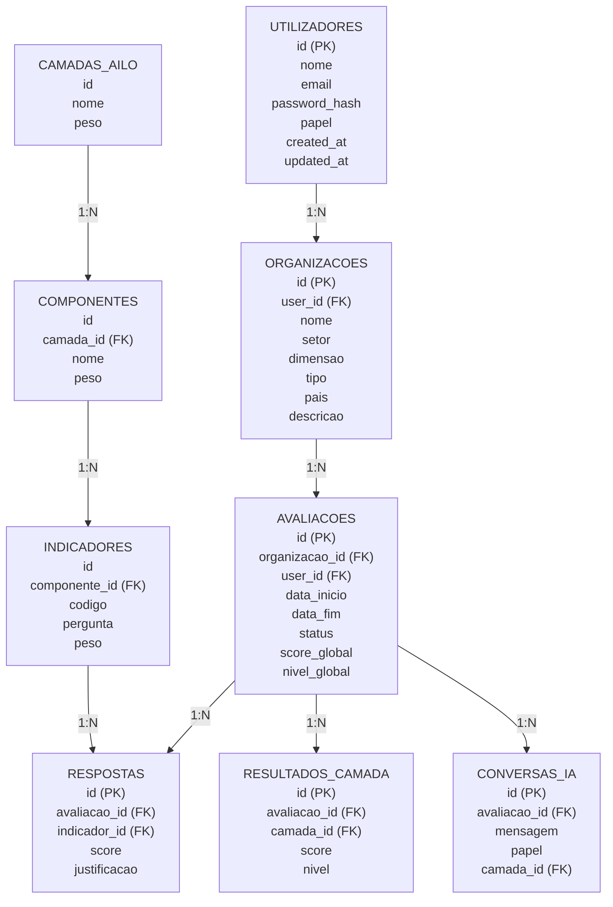
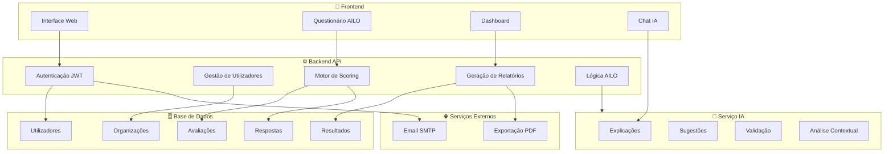

# Modelo de Dados — Esquema Relacional AILO

## 1. Diagrama Entidade-Relacionamento (Textual)



---

## 2. Esquema SQL (SQLite/PostgreSQL)



---

## 3. Dados Iniciais (Seed Data)

### 3.1. Camadas AILO

```sql
INSERT INTO camadas_ailo (nome, nome_en, descricao, peso, ordem, cor) VALUES
('Organizacional', 'Organizational', 'Liga a aprendizagem organizacional à estratégia, processos, decisão e criação de valor.', 1.0, 1, '#2E4057'),
('Humana', 'Human', 'Fundação da aprendizagem: pessoas, cultura, autonomia e ética.', 1.2, 2, '#048A81'),
('Aprendizagem', 'Learning', 'Contextos, experiências e processos de aprendizagem organizacional.', 1.0, 3, '#54C6EB'),
('Cognitiva (IA)', 'Cognitive (AI)', 'IA como mediador cognitivo: geração, recomendação, síntese e previsão.', 1.0, 4, '#8EE3EF'),
('Tecnológica', 'Technological', 'Infraestrutura que suporta o ecossistema AILO.', 0.8, 5, '#7C77B9'),
('Avaliação', 'Evaluation', 'Processo contínuo e formativo que fecha o ciclo de aprendizagem.', 1.0, 6, '#E8567F');
```

### 3.2. Componentes (exemplo — Camada Organizacional)

```sql
-- Assumindo camada_id = 1 para Organizacional
INSERT INTO componentes (camada_id, nome, nome_en, descricao, peso, ordem) VALUES
(1, 'Estratégia', 'Strategy', 'Alinhamento entre aprendizagem, inovação e objetivos organizacionais.', 1.0, 1),
(1, 'Processos', 'Processes', 'Integração da aprendizagem nos fluxos de trabalho e rotinas de gestão.', 1.0, 2),
(1, 'Decisão', 'Decision-Making', 'Utilização de evidência suportada por IA preservando julgamento humano.', 1.0, 3),
(1, 'Valor', 'Value', 'Impacto no desempenho, inovação, resiliência e sustentabilidade.', 1.0, 4);
```

> Os seeds completos para todas as 6 camadas, 23 componentes e 51 indicadores estão definidos no ficheiro `02_indicadores_por_camada.md` e serão implementados na Fase 2.

---

## 4. Relações e Cardinalidades

| Relação | Cardinalidade | Descrição |
|---------|---------------|-----------|
| utilizadores → organizacoes | 1:N | Um utilizador pode ter múltiplas organizações |
| organizacoes → avaliacoes | 1:N | Uma organização pode ter múltiplas avaliações |
| avaliacoes → respostas | 1:N | Uma avaliação tem múltiplas respostas (1 por indicador) |
| camadas_ailo → componentes | 1:N | Cada camada tem múltiplos componentes |
| componentes → indicadores | 1:N | Cada componente tem múltiplos indicadores |
| avaliacoes → resultados_camada | 1:N | Uma avaliação tem 6 resultados (1 por camada) |
| avaliacoes → interdependencias | 1:N | Uma avaliação tem múltiplas análises de interdependência |
| avaliacoes → conversas_ia | 1:N | Uma avaliação tem múltiplas mensagens de chat |
| avaliacoes → recomendacoes | 1:N | Uma avaliação gera múltiplas recomendações |
| avaliacoes → relatorios | 1:1 | Uma avaliação gera um relatório |
