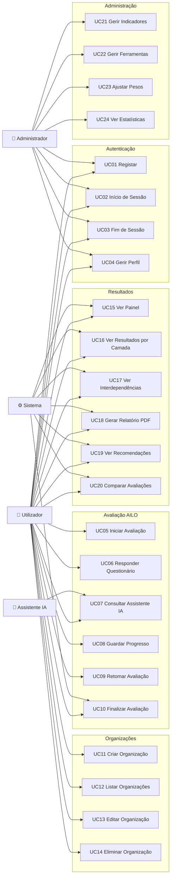
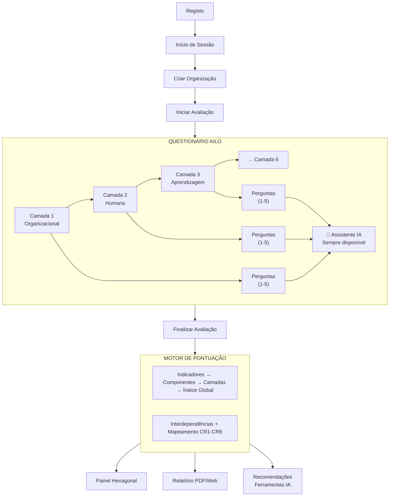

# Casos de Uso

## 1. Atores

| Ator | Descrição |
|------|-----------|
| **Utilizador** | Gestor, empresário ou responsável organizacional que realiza avaliações AILO |
| **Administrador** | Gestor da plataforma. Gere indicadores, ferramentas e configurações |
| **Assistente IA** | Agente conversacional (LLM) que medeia a interação do utilizador com o AILO |
| **Sistema** | Motor de scoring, geração de relatórios e recomendações |

---

## 2. Diagrama de Casos de Uso

---

## 3. Descrição Detalhada dos Casos de Uso Principais

### UC05 — Iniciar Avaliação

| Campo | Descrição |
|-------|-----------|
| **Ator** | Utilizador |
| **Pré-condição** | Utilizador autenticado. Tem pelo menos 1 organização. |
| **Pós-condição** | Nova avaliação criada com status "em_curso". |
| **Fluxo Principal** | 1. Utilizador seleciona organização → 2. Clica "Iniciar Avaliação" → 3. Sistema cria avaliação → 4. Redireciona para questionário (Camada 1) |
| **Fluxo Alternativo** | Se organização já tem avaliação em curso → sistema pergunta se quer retomar ou iniciar nova |

### UC06 — Responder Questionário

| Campo | Descrição |
|-------|-----------|
| **Ator** | Utilizador, Assistente IA |
| **Pré-condição** | Avaliação em curso. |
| **Pós-condição** | Respostas guardadas na BD. |
| **Fluxo Principal** | 1. Sistema apresenta perguntas da camada atual (ex: Organizacional) → 2. Utilizador responde indicadores (escala 1-5) → 3. Pode opcionalmente adicionar justificação → 4. Respostas auto-guardadas → 5. Utilizador avança para próxima camada |
| **Fluxo Alternativo** | Utilizador clica "?" num indicador → abre chat com assistente IA contextualizado a esse indicador |
| **Regras** | Navegação condicional: indicadores com `condicao` só aparecem se a condição for satisfeita |

### UC07 — Consultar Assistente IA

| Campo | Descrição |
|-------|-----------|
| **Atores** | Utilizador, Assistente IA |
| **Pré-condição** | Avaliação em curso. Chat lateral visível. |
| **Pós-condição** | Resposta do assistente apresentada. Mensagens guardadas. |
| **Fluxo Principal** | 1. Utilizador escreve pergunta no chat → 2. Sistema envia ao LLM com contexto (camada atual, tipo de organização, respostas anteriores) → 3. Assistente responde → 4. Mensagens gravadas em `conversas_ia` |
| **Exemplos** | "O que é double-loop learning?", "Este nível aplica-se à minha escola?", "As minhas respostas são consistentes?" |

### UC10 — Finalizar Avaliação

| Campo | Descrição |
|-------|-----------|
| **Atores** | Utilizador, Sistema |
| **Pré-condição** | Todos os indicadores obrigatórios respondidos. |
| **Pós-condição** | Scoring calculado. Resultados e relatório gerados. |
| **Fluxo Principal** | 1. Utilizador clica "Finalizar" → 2. Sistema valida completude → 3. Motor de scoring calcula: scores por indicador → por componente → por camada → global → 4. Sistema analisa interdependências → 5. Sistema mapeia CR1-CR6 → 6. Resultados gravados → 7. Relatório gerado → 8. Utilizador redirecionado para dashboard de resultados |
| **Fluxo Alternativo** | Se indicadores obrigatórios em falta → sistema alerta e indica quais faltam |

### UC15 — Ver Dashboard

| Campo | Descrição |
|-------|-----------|
| **Ator** | Utilizador |
| **Pré-condição** | Avaliação completa. |
| **Pós-condição** | Dashboard apresentado com visualizações. |
| **Fluxo Principal** | 1. Utilizador acede ao dashboard → 2. Sistema apresenta: gráfico hexagonal AILO (scores das 6 camadas), índice global, classificação de maturidade, indicadores semáforo → 3. Utilizador pode clicar em cada camada para ver detalhe |
| **Componentes visuais** | Hexágono AILO (Figura 1), barras de progresso, indicadores vermelhos/amarelos/verdes, tabela de interdependências |

### UC18 — Gerar Relatório PDF

| Campo | Descrição |
|-------|-----------|
| **Atores** | Utilizador, Sistema |
| **Pré-condição** | Avaliação completa. |
| **Pós-condição** | PDF gerado e disponível para download. |
| **Fluxo Principal** | 1. Utilizador clica "Gerar PDF" → 2. Sistema compila dados: perfil da organização, scores por camada, pontos fortes, lacunas, interdependências, CRs relevantes, recomendações → 3. Gera PDF com template formatado → 4. PDF disponível para download |
| **Estrutura do PDF** | Capa → Resumo Executivo → Diagnóstico por Camada (6 secções) → Interdependências → Recomendações → Roteiro de Implementação |

---

## 4. Fluxo de Utilização Completo

