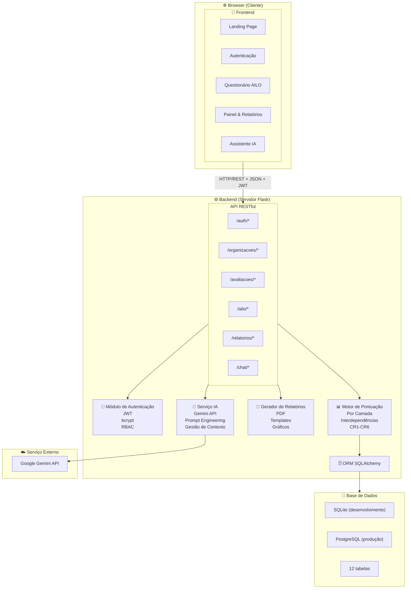
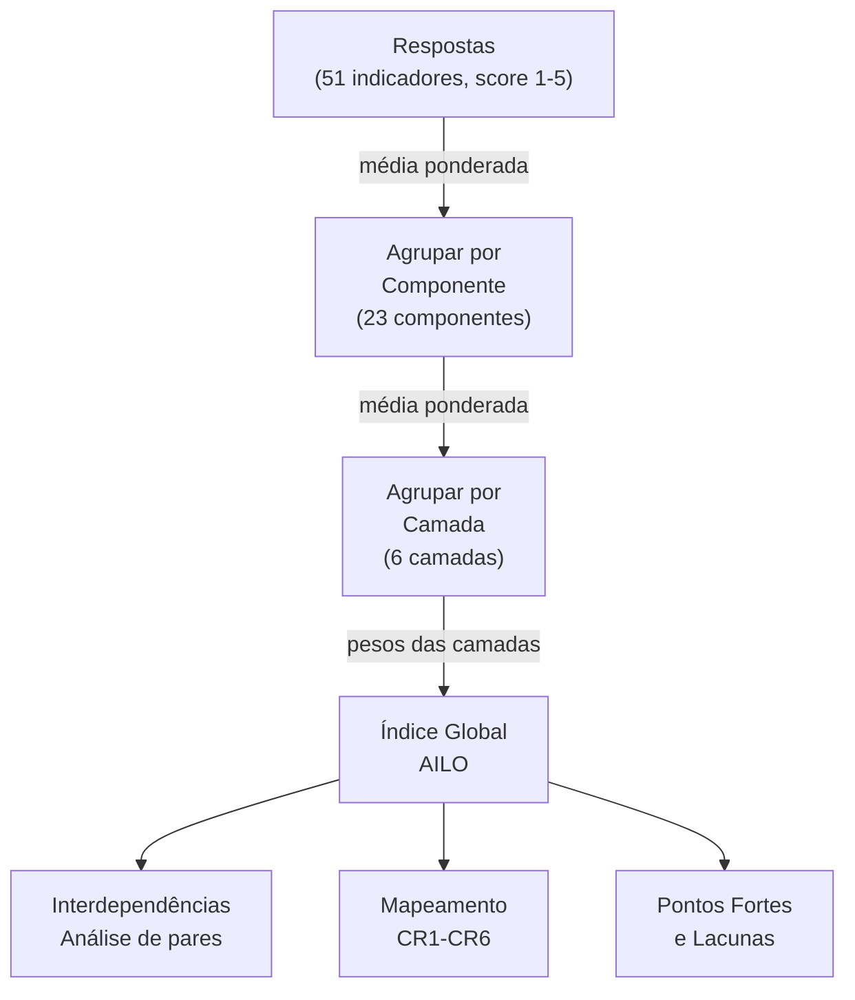

# Arquitetura do Sistema

## 1. Visão Geral

A arquitetura segue um padrão de **3 camadas** (frontend, backend, base de dados) com integração externa a um serviço LLM. A escolha reflete as necessidades académicas do projeto — simplicidade de deployment, facilidade de manutenção e alinhamento com as disciplinas do curso.



---

## 2. Stack Tecnológica

| Camada | Tecnologia | Justificação |
|--------|-----------|-------------|
| **Frontend** | HTML5, CSS3, JavaScript (Vanilla) | Simplicidade, sem dependências de build. Compatível com disciplinas do curso (Lab. Sistemas Web). |
| **Backend** | Python 3.11+ / Flask | Leve, flexível, ecossistema Python ideal para integração com IA. |
| **ORM** | SQLAlchemy | Abstração da BD, migrations, seed data. |
| **BD (dev)** | SQLite | Zero configuração, ficheiro único, ideal para desenvolvimento e demonstração. |
| **BD (prod)** | PostgreSQL | Robusto, escalável, suporta JSON nativo e concorrência. |
| **Auth** | JWT (PyJWT) + bcrypt | Standard da indústria para APIs RESTful. |
| **LLM** | Google Gemini API | Custo acessível, boa performance em português, API simples. |
| **PDF** | ReportLab ou WeasyPrint | Geração de PDFs profissionais a partir de templates. |
| **Charts** | Chart.js (frontend) | Leve, responsivo, ideal para gráficos radar/hexagonais. |
| **Versionamento** | Git + GitHub | Controlo de versões e entrega ao professor. |

---

## 3. Estrutura de Pastas

```mermaid
flowchart TB

ROOT["📁 Projeto_AILO"]

ROOT --> BACK["📁 backend"]
ROOT --> FRONT["📁 frontend"]
ROOT --> DOCS["📁 docs"]
ROOT --> FASE["📁 Fase_1"]
ROOT --> DOCX["📄 Documentos .docx"]
ROOT --> GIT["📄 .gitignore"]

BACK --> APP["📁 app"]
BACK --> MIG["📁 migrations"]
BACK --> SEEDS["📁 seeds"]
BACK --> TESTS["📁 tests"]
BACK --> ENV["📄 .env.example"]
BACK --> REQ["📄 requirements.txt"]
BACK --> RUN["📄 run.py"]
BACK --> SEEDPY["📄 seed.py"]

APP --> MODELS["📁 models"]
APP --> ROUTES["📁 routes"]
APP --> SERVICES["📁 services"]
APP --> UTILS["📁 utils"]
APP --> INIT["📄 __init__.py"]
APP --> CONFIG["📄 config.py"]

MODELS --> M1["utilizador.py"]
MODELS --> M2["organizacao.py"]
MODELS --> M3["ailo.py"]
MODELS --> M4["avaliacao.py"]
MODELS --> M5["resposta.py"]
MODELS --> M6["resultado.py"]
MODELS --> M7["ferramenta.py"]
MODELS --> M8["conversa.py"]

ROUTES --> R1["auth.py"]
ROUTES --> R2["organizacoes.py"]
ROUTES --> R3["ailo.py"]
ROUTES --> R4["avaliacoes.py"]
ROUTES --> R5["respostas.py"]
ROUTES --> R6["resultados.py"]
ROUTES --> R7["chat.py"]
ROUTES --> R8["relatorios.py"]

SERVICES --> S1["scoring.py"]
SERVICES --> S2["interdependencias.py"]
SERVICES --> S3["ia_assistant.py"]
SERVICES --> S4["report_generator.py"]
SERVICES --> S5["recomendacoes.py"]

UTILS --> U1["auth.py"]
UTILS --> U2["decorators.py"]
UTILS --> U3["validators.py"]

SEEDS --> SD1["camadas.py"]
SEEDS --> SD2["componentes.py"]
SEEDS --> SD3["indicadores.py"]
SEEDS --> SD4["ferramentas.py"]

TESTS --> T1["test_auth.py"]
TESTS --> T2["test_scoring.py"]
TESTS --> T3["test_api.py"]
TESTS --> T4["test_interdependencias.py"]

FRONT --> HTML["📄 index.html"]
FRONT --> CSS["📁 css"]
FRONT --> JS["📁 js"]
FRONT --> PAGES["📁 pages"]

CSS --> C1["main.css"]
CSS --> C2["questionario.css"]
CSS --> C3["dashboard.css"]
CSS --> C4["relatorio.css"]

JS --> J1["app.js"]
JS --> J2["api.js"]
JS --> J3["auth.js"]
JS --> J4["questionario.js"]
JS --> J5["chat.js"]
JS --> J6["dashboard.js"]
JS --> J7["relatorio.js"]

PAGES --> P1["login.html"]
PAGES --> P2["register.html"]
PAGES --> P3["organizacoes.html"]
PAGES --> P4["questionario.html"]
PAGES --> P5["dashboard.html"]
PAGES --> P6["relatorio.html"]

DOCS --> D1["📁 Fase_1"]
```



---

## 4. Módulos Principais

### 4.1. Motor de Scoring (`services/scoring.py`)



### 4.2. Assistente IA (`services/ia_assistant.py`)

```mermaid
flowchart TB

M["Mensagem do Utilizador"]

C["Construir Contexto<br/>- System prompt AILO<br/>- Camada atual<br/>- Tipo de organização<br/>- Respostas dadas<br/>- Histórico do chat"]

G["Google Gemini API<br/>(gemini-2.0-flash)"]

R["Resposta formatada<br/>+ Gravar em BD"]

M --> C
C --> G
G --> R

### 4.3. Gerador de Relatórios (`services/report_generator.py`)

```mermaid
flowchart TB

D["Dados da avaliação completa"]

T["Template do relatório<br/>1. Capa<br/>2. Resumo Executivo<br/>3. Perfil da Organização<br/>4. Diagnóstico das 6 camadas<br/>5. Interdependências<br/>6. CRs relevantes<br/>7. Recomendações<br/>8. Roteiro de Implementação"]

W["Web View<br/>(HTML)"]

P["PDF<br/>Download"]

D --> T

T --> W
T --> P

---

## 5. Padrões e Decisões de Design

| Decisão | Justificação |
|---------|-------------|
| **API RESTful** | Standard, testável, desacoplado do frontend |
| **JWT stateless** | Sem sessões no servidor, escalável |
| **SQLAlchemy ORM** | Abstração da BD, código Python limpo, migrations |
| **Service layer** | Separação entre routes (HTTP) e lógica de negócio |
| **Seed data** | Framework AILO carregado na BD na primeira execução |
| **Vanilla JS** | Sem frameworks frontend — simplicidade e alinhamento com disciplinas |
| **Chart.js** | Única dependência frontend — gráficos radar para o hexágono AILO |
| **Gemini API** | Custo acessível, boa qualidade em PT, API simples |

---

## 6. Segurança

| Mecanismo | Implementação |
|-----------|--------------|
| Autenticação | JWT com expiração de 24h. Refresh via re-login. |
| Password hashing | bcrypt com salt rounds ≥ 12 |
| Autorização | Decorator `@login_required` em todas as rotas protegidas |
| RBAC | Papel `admin` / `utilizador` verificado por decorator |
| Input validation | Validação no backend antes de queries à BD |
| SQL Injection | Prevenido pelo ORM (parametrized queries) |
| XSS | Escape de HTML em outputs. Content-Security-Policy headers. |
| CORS | Configurado para permitir apenas origens autorizadas |
| API keys | Chave Gemini apenas no backend (.env), nunca no frontend |

---

## 7. Deployment (Demonstração)

```
    ┌─────────────────────────────┐
    │    Servidor de Demonstração  │
    │                             │
    │    gunicorn (WSGI)          │
    │         │                   │
    │         ▼                   │
    │    Flask App                │
    │    + SQLite DB              │
    │    + Static Files (frontend)│
    │                             │
    │    Port: 5000               │
    └─────────────────────────────┘
```

Para demonstração académica, o Flask serve também os ficheiros estáticos do frontend. Em produção, seria separado com Nginx.
