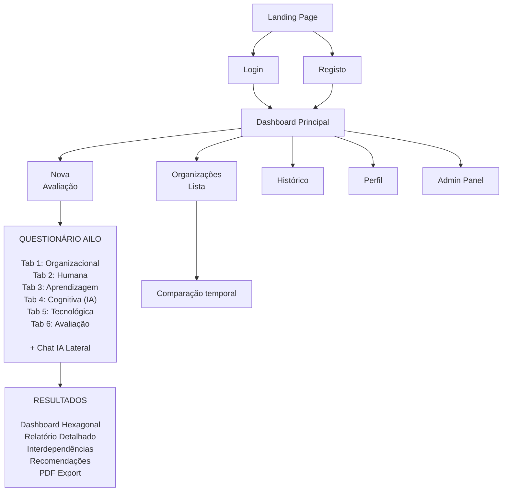
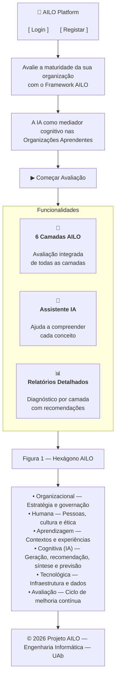
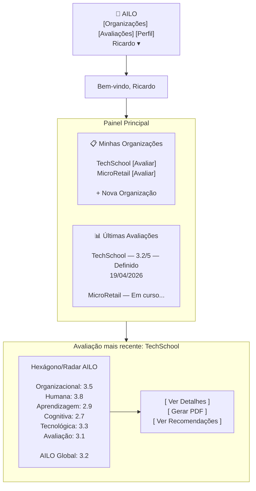
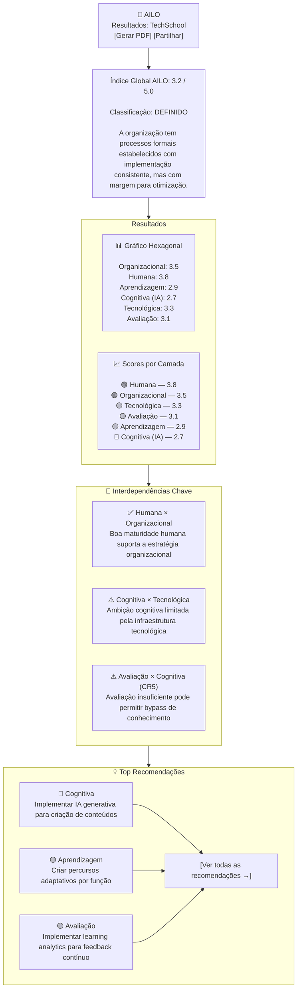
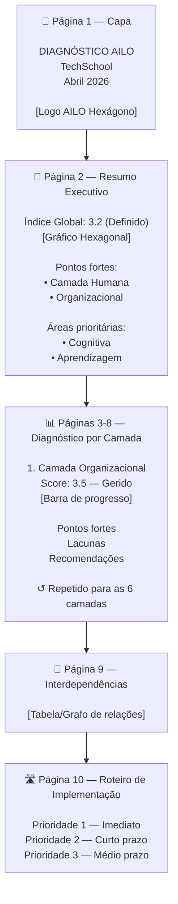

# Wireframes e Prototipagem UI/UX

## 1. Mapa de Navegação

---

## 2. Wireframes Detalhados

### 2.1. Landing Page

### 2.2. Dashboard Principal (após login)

### 2.3. Questionário AILO

```mermaid
flowchart TB

TOP["🔷 AILO<br/>Avaliação: TechSchool<br/>Progresso: 67%"]

LAYERS["✅ Organizacional | ✅ Humana | 🔵 Aprendizagem | ○ Cognitiva | ○ Tecnológica | ○ Avaliação"]

subgraph MAIN["QUESTIONÁRIO AILO"]

subgraph LEFT["Questionário"]

TITLE["Camada de Aprendizagem"]

COMP["📌 Contextos Adaptativos"]

Q1["A.C.1 — Personalização de percursos<br/><br/>Qual o nível de personalização dos percursos de aprendizagem?<br/><br/>○ 1 — One-size-fits-all<br/>○ 2 — Alguma diferenciação<br/>● 3 — Percursos por perfil/função<br/>○ 4 — Adaptação parcial por IA<br/>○ 5 — IA gera percursos adaptativos"]

JUST["Justificação:<br/>Temos percursos por função..."]

Q2["A.C.2 — Ambientes de aprendizagem<br/>..."]

COMP2["📌 Experiências Personalizadas"]

NAV["[← Camada Anterior]  [Próxima Camada →]"]

end

subgraph RIGHT["💬 Assistente AILO"]

HELP["Olá! Estamos na Camada de Aprendizagem.<br/><br/>Esta camada avalia como a organização cria ambientes de aprendizagem adaptativos."]

USER["O que são contextos adaptativos?"]

BOT["Contextos adaptativos são ambientes de aprendizagem que se ajustam ao perfil, função e necessidades de cada aprendente."]

INPUT["Escreva aqui..."]

SEND["[Enviar]"]

end

end

BOTTOM["Auto-save ativo ✓<br/>Última gravação: 18:45"]

TOP --> LAYERS
LAYERS --> MAIN
MAIN --> BOTTOM

TITLE --> COMP
COMP --> Q1
Q1 --> JUST
JUST --> Q2
Q2 --> COMP2
COMP2 --> NAV

HELP --> USER
USER --> BOT
BOT --> INPUT
INPUT --> SEND
```

### 2.4. Dashboard de Resultados

### 2.5. Relatório PDF — Estrutura

---

## 3. Design System

### 3.1. Paleta de Cores (alinhada com AILO)

| Elemento | Cor | Hex | Uso |
|----------|-----|-----|-----|
| Primary | Azul escuro | `#2E4057` | Headers, botões primários |
| Organizacional | Azul escuro | `#2E4057` | Camada organizacional |
| Humana | Verde teal | `#048A81` | Camada humana |
| Aprendizagem | Azul claro | `#54C6EB` | Camada aprendizagem |
| Cognitiva (IA) | Ciano | `#8EE3EF` | Camada cognitiva |
| Tecnológica | Púrpura | `#7C77B9` | Camada tecnológica |
| Avaliação | Rosa | `#E8567F` | Camada avaliação |
| Background | Cinza claro | `#F5F7FA` | Fundo geral |
| Surface | Branco | `#FFFFFF` | Cards e painéis |
| Text | Cinza escuro | `#333333` | Texto principal |
| Success | Verde | `#27AE60` | Nível bom (≥3.5) |
| Warning | Amarelo | `#F39C12` | Nível médio (2.7-3.4) |
| Danger | Vermelho | `#E74C3C` | Nível baixo (<2.7) |

### 3.2. Tipografia

| Elemento | Font | Peso | Tamanho |
|----------|------|------|---------|
| H1 | Inter | 700 | 28px |
| H2 | Inter | 600 | 22px |
| H3 | Inter | 600 | 18px |
| Body | Inter | 400 | 15px |
| Small | Inter | 400 | 13px |
| Labels | Inter | 500 | 12px |

### 3.3. Componentes Base

- **Cards**: `border-radius: 12px`, `box-shadow: 0 2px 8px rgba(0,0,0,0.08)`, `padding: 24px`
- **Botões**: `border-radius: 8px`, `padding: 10px 20px`, hover com `transform: translateY(-1px)`
- **Inputs**: `border: 1px solid #E0E0E0`, `border-radius: 6px`, focus com `border-color: #2E4057`
- **Chat bubble**: `border-radius: 16px 16px 16px 0`, fundo `#F0F4F8`
- **Progress bars**: `height: 8px`, `border-radius: 4px`, cor da camada correspondente

### 3.4. Responsividade

| Breakpoint | Largura | Layout |
|-----------|---------|--------|
| Mobile | < 768px | Stack vertical, chat em fullscreen overlay |
| Tablet | 768-1024px | Questionário e chat side-by-side (60/40) |
| Desktop | > 1024px | Layout completo com sidebar (70/30) |
