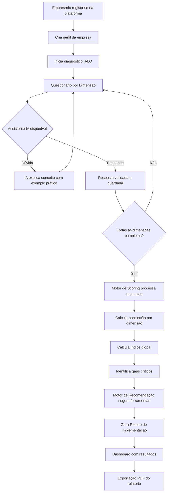

# Análise do Framework IALO
## Innovative Action Learning Organisation

**Projeto**: Ambiente Web para Framework IALO  
**Fase**: 1 — Levantamento e Modelação  
**Data**: 25/03/2026  

---

## 1. Introdução ao Framework IALO

O Framework IALO (Innovative Action Learning Organisation) é um modelo conceptual de avaliação de maturidade digital e prontidão para adoção de Inteligência Artificial (IA), direcionado a Micro e Pequenas Empresas (MPEs).

### 1.1. Propósito

O framework tem como objetivo:
- **Diagnosticar** o nível atual de maturidade digital de uma organização
- **Identificar** lacunas (gaps) nas capacidades necessárias para adoção de IA
- **Orientar** a empresa com um roteiro de implementação personalizado
- **Democratizar** o acesso a diagnóstico estratégico anteriormente reservado a grandes empresas com acesso a consultoria especializada

### 1.2. Público-Alvo

Micro e Pequenas Empresas (MPEs) que:
- Não possuem departamentos de TI dedicados
- Têm orçamentos limitados para consultoria estratégica
- Sentem dificuldade em acompanhar a evolução das tecnologias de IA
- Querem perceber onde e como a IA pode beneficiar o seu negócio

---

## 2. Dimensões de Maturidade

O framework define **5 dimensões** para avaliar a maturidade digital e a prontidão para IA de uma organização. Cada dimensão é avaliada independentemente e contribui para o índice global de maturidade.

### 2.1. Dimensão: DADOS

**Definição**: Avalia como a organização recolhe, armazena, organiza e utiliza dados para suporte à decisão.

| ID | Indicador | Descrição |
|----|-----------|-----------|
| D1 | Recolha de Dados | Existência de processos sistemáticos de recolha de dados (vendas, clientes, operações) |
| D2 | Armazenamento Digital | Grau de digitalização do armazenamento (papel vs. digital vs. cloud) |
| D3 | Qualidade e Organização | Dados estruturados, limpos e acessíveis vs. dispersos e inconsistentes |
| D4 | Utilização para Decisão | Dados são efetivamente usados para tomar decisões de negócio |
| D5 | Segurança e Privacidade | Existência de práticas de proteção e backup de dados |

**Perguntas-Guia do Questionário**:
1. Como regista as vendas e transações da sua empresa? (caderno / Excel / software dedicado / ERP)
2. Onde estão guardados os dados dos seus clientes? (não tem / papel / ficheiro no computador / sistema na nuvem)
3. Consegue facilmente saber quantos clientes tem, o que mais vendem, ou qual o mês com mais receita?
4. Já usou dados do negócio para tomar uma decisão importante? (ex.: mudar horários, alterar preços, escolher fornecedores)
5. Faz cópias de segurança (backups) dos seus dados? Com que frequência?

**Peso na pontuação global**: 25%

---

### 2.2. Dimensão: INFRAESTRUTURA

**Definição**: Avalia as ferramentas tecnológicas, hardware, software e conectividade disponíveis na organização.

| ID | Indicador | Descrição |
|----|-----------|-----------|
| I1 | Hardware e Dispositivos | Computadores, tablets, smartphones disponíveis para operação |
| I2 | Software e Ferramentas | Utilização de software de gestão, produtividade, comunicação |
| I3 | Conectividade | Qualidade e fiabilidade da ligação à internet |
| I4 | Presença Digital | Website, redes sociais, Google Business, plataformas de e-commerce |
| I5 | Integração de Sistemas | Ferramentas comunicam entre si ou funcionam isoladamente |

**Perguntas-Guia do Questionário**:
1. Que equipamentos tecnológicos usa no dia-a-dia do negócio?
2. Usa algum software para gerir o negócio? (faturação, stock, CRM, contabilidade)
3. A internet no seu local de trabalho é rápida e fiável?
4. A sua empresa tem website, redes sociais ou página no Google?
5. Os diferentes programas/ferramentas que usa "falam" entre si ou tem de passar informação manualmente?

**Peso na pontuação global**: 20%

---

### 2.3. Dimensão: COMPETÊNCIAS

**Definição**: Avalia o nível de literacia digital e capacidades técnicas das pessoas na organização.

| ID | Indicador | Descrição |
|----|-----------|-----------|
| C1 | Literacia Digital Básica | Colaboradores sabem usar computador, email, internet com confiança |
| C2 | Competências em Ferramentas | Capacidade de usar software de produtividade e gestão |
| C3 | Abertura à Aprendizagem | Disposição para aprender novas ferramentas e tecnologias |
| C4 | Conhecimento de IA | Noção básica do que é IA e onde pode ser aplicada |
| C5 | Formação e Desenvolvimento | Existência de práticas de formação contínua na organização |

**Perguntas-Guia do Questionário**:
1. Os colaboradores sentem-se confortáveis a usar computadores e ferramentas digitais?
2. Alguém na empresa sabe usar Excel, Google Sheets ou ferramentas semelhantes?
3. Se introduzisse uma nova ferramenta digital amanhã, como reagiriam os colaboradores?
4. Já ouviu falar de Inteligência Artificial? Consegue dar um exemplo de utilização?
5. Na empresa, há investimento em formação ou é cada um por si?

**Peso na pontuação global**: 20%

---

### 2.4. Dimensão: ESTRATÉGIA

**Definição**: Avalia a existência de visão estratégica para a digitalização e a adoção de IA.

| ID | Indicador | Descrição |
|----|-----------|-----------|
| E1 | Visão Digital | Existe um plano ou visão para a digitalização do negócio |
| E2 | Investimento em Tecnologia | Há orçamento dedicado a tecnologia e inovação |
| E3 | Identificação de Oportunidades | A empresa identifica onde a tecnologia pode melhorar processos |
| E4 | Planeamento de IA | Existem planos concretos ou interesse em adotar IA |
| E5 | Alinhamento com Objetivos | A tecnologia está alinhada com os objetivos de negócio |

**Perguntas-Guia do Questionário**:
1. Tem algum plano ou ideia para tornar o seu negócio mais digital nos próximos anos?
2. Quanto investe anualmente em tecnologia? (nada / pouco / algum / bastante)
3. Consegue identificar pelo menos uma área do negócio onde a tecnologia poderia ajudar?
4. Já considerou usar IA no seu negócio? Para quê?
5. Quando pensa no futuro do negócio, a tecnologia faz parte dessa visão?

**Peso na pontuação global**: 20%

---

### 2.5. Dimensão: CULTURA

**Definição**: Avalia a cultura organizacional face à inovação, mudança e adoção tecnológica.

| ID | Indicador | Descrição |
|----|-----------|-----------|
| CU1 | Abertura à Mudança | A organização aceita e promove mudanças nos processos |
| CU2 | Cultura de Inovação | Há incentivo à experimentação e novas ideias |
| CU3 | Liderança Tecnológica | A gestão/liderança promove ativamente a adoção tecnológica |
| CU4 | Colaboração | Existem práticas de partilha de conhecimento e trabalho colaborativo |
| CU5 | Resiliência | Capacidade de lidar com falhas e aprender com erros na adoção tecnológica |

**Perguntas-Guia do Questionário**:
1. Quando surge uma nova forma de fazer algo, a reação habitual é "vamos experimentar" ou "sempre fizemos assim"?
2. Os colaboradores podem sugerir melhorias ou novas ideias? São ouvidos?
3. O dono/gestor da empresa puxa pela inovação ou prefere manter o que funciona?
4. Trabalham em equipa e partilham informação, ou cada um trata do seu?
5. Quando algo tecnológico correu mal, a reação foi desistir ou tentar de outra forma?

**Peso na pontuação global**: 15%

---

## 3. Escala de Maturidade

Cada dimensão é avaliada numa escala de **5 níveis**, com base na pontuação obtida:

| Nível | Nome | Pontuação | Descrição |
|-------|------|-----------|-----------|
| 1 | **Inicial** | 0–20% | Praticamente sem práticas digitais. Processos manuais, sem dados organizados, sem estratégia digital. |
| 2 | **Em Desenvolvimento** | 21–40% | Primeiros passos na digitalização. Algumas ferramentas básicas, mas sem integração ou estratégia. |
| 3 | **Definido** | 41–60% | Práticas digitais estabelecidas em algumas áreas. Dados parcialmente organizados. Início de visão estratégica. |
| 4 | **Gerido** | 61–80% | Digitalização integrada na operação. Dados utilizados para decisão. Estratégia digital clara. Pronto para IA básica. |
| 5 | **Otimizado** | 81–100% | Maturidade digital avançada. Dados de alta qualidade. Uso ativo de IA ou prontidão total para implementação. |

---

## 4. Sistema de Scoring

### 4.1. Pontuação por Indicador

Cada indicador é avaliado numa escala de **1 a 5** com base nas respostas do questionário:

| Valor | Significado |
|-------|-------------|
| 1 | Inexistente / Não aplicável |
| 2 | Rudimentar / Muito básico |
| 3 | Parcial / Em desenvolvimento |
| 4 | Bom / Estabelecido |
| 5 | Excelente / Avançado |

### 4.2. Pontuação por Dimensão

```
Pontuação_Dimensão = (Σ Pontuação_Indicadores) / (Nº_Indicadores × 5) × 100%
```

Exemplo: Dimensão DADOS com pontuações [3, 2, 4, 3, 2]:
```
Pontuação_DADOS = (3+2+4+3+2) / (5×5) × 100% = 14/25 × 100% = 56% → Nível 3 (Definido)
```

### 4.3. Índice Global de Maturidade

```
Índice_Global = Σ (Pontuação_Dimensão × Peso_Dimensão)
```

Com os pesos definidos:

| Dimensão | Peso |
|----------|------|
| Dados | 25% |
| Infraestrutura | 20% |
| Competências | 20% |
| Estratégia | 20% |
| Cultura | 15% |
| **Total** | **100%** |

### 4.4. Identificação de Gaps

Um **gap crítico** é identificado quando:
- Uma dimensão tem pontuação ≤ 40% (Nível 1 ou 2)
- A diferença entre a dimensão mais forte e mais fraca é > 40 pontos percentuais
- Um indicador individual tem pontuação 1 (Inexistente)

### 4.5. Lógica Fuzzy para Respostas Qualitativas

Para perguntas que não têm resposta numérica direta, aplica-se uma conversão fuzzy:

| Resposta Qualitativa | Valor Fuzzy |
|----------------------|-------------|
| "Nunca / Não" | 1.0 |
| "Raramente / Quase nunca" | 1.5 |
| "Às vezes / Parcialmente" | 3.0 |
| "Frequentemente / Sim, mas..." | 4.0 |
| "Sempre / Sim, completamente" | 5.0 |

---

## 5. Processo de Avaliação



---

## 6. Papel do Assistente IA no Framework

O assistente de IA tem três funções dentro do processo IALO:

### 6.1. Tradução de Conceitos
Quando o utilizador não compreende um termo técnico (ex.: "dados estruturados"), o assistente explica usando exemplos práticos do setor da empresa.

**Exemplo**:
> **Utilizador**: O que são dados estruturados?  
> **Assistente**: Imagine a lista de clientes que tem no seu telemóvel — nome e número organizados. Isso são dados estruturados. Agora imagine as mensagens de WhatsApp com encomendas — tudo misturado, sem ordem. Isso são dados NÃO estruturados. A pergunta é: a informação do seu negócio está mais parecida com a lista ou com as mensagens?

### 6.2. Validação de Consistência
O assistente deteta contradições nas respostas e alerta o utilizador.

**Exemplo**:
> **Alerta IA**: Na pergunta anterior disse que não tem dados digitais, mas indicou que usa um software de faturação há 3 anos. O software de faturação gera dados digitais sobre vendas e clientes. Podemos rever a resposta anterior?

### 6.3. Contextualização por Setor
O assistente adapta exemplos e recomendações ao setor específico da empresa (retalho, restauração, serviços, construção, etc.).

---

## 7. Outputs do Framework

Após a avaliação, o framework produz:

1. **Mapa de Maturidade**: Gráfico radar com as 5 dimensões
2. **Nível Global de Maturidade**: Classificação de 1 a 5 com descrição
3. **Lista de Gaps Críticos**: Áreas com pontuação insuficiente, ordenadas por prioridade
4. **Roteiro de Implementação**: Documento com:
   - Pontos fortes identificados
   - Necessidades prioritárias
   - 3-5 ações concretas de curto prazo
   - Ferramentas de IA recomendadas (acessíveis, baixo custo)
   - Estimativa de esforço/complexidade por ação
