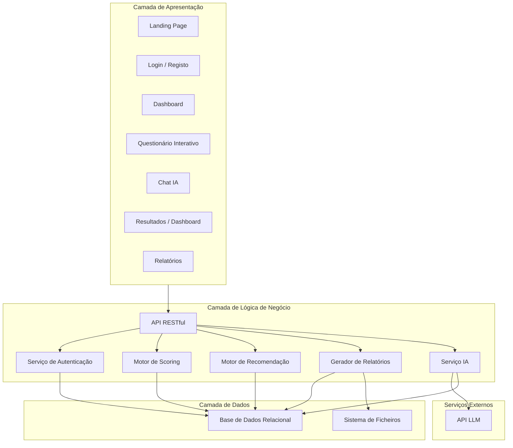
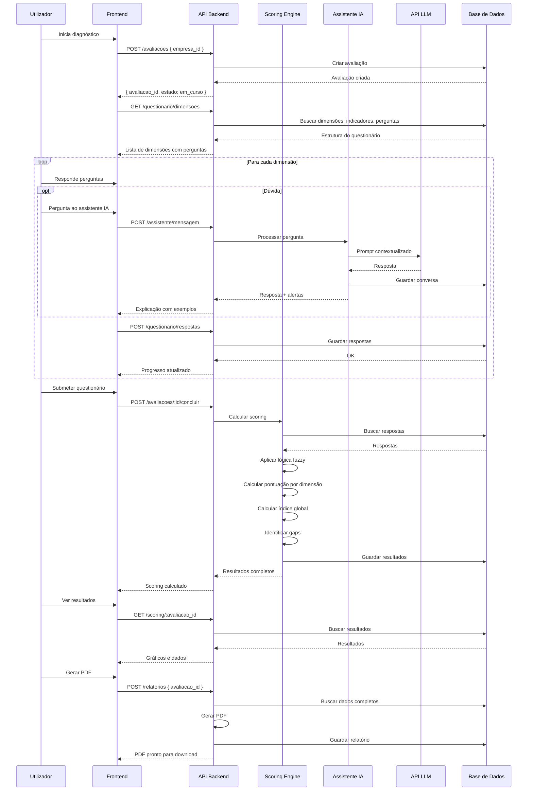

# Arquitetura de Software
## Ambiente Web para Framework IALO

**Projeto**: Ambiente Web para Framework IALO  
**Fase**: 1 — Levantamento e Modelação  
**Data**: 25/03/2026  

---

## 1. Visão Geral da Arquitetura

A aplicação segue uma **arquitetura em 3 camadas** (Three-Tier Architecture) com separação clara entre apresentação, lógica de negócio e dados.



---

## 2. Stack Tecnológica Proposta

| Camada | Tecnologia | Justificação |
|--------|-----------|-------------|
| **Frontend** | HTML5 + CSS3 + JavaScript (Vanilla ou com framework leve) | Simplicidade, sem dependências pesadas, acessível. Possível evolução para React/Vue. |
| **Backend** | Python + Flask | Linguagem familiar, excelente ecossistema de bibliotecas IA/ML, framework leve e flexível. |
| **Base de Dados** | SQLite (dev) → PostgreSQL (prod) | SQLite para desenvolvimento rápido sem servidor. PostgreSQL para produção com melhor concorrência e JSON nativo. |
| **ORM** | SQLAlchemy | Abstração de BD, migrations com Alembic, suporte a múltiplos SGBD. |
| **Autenticação** | flask-jwt-extended | JWT tokens com refresh, blacklist, decorators de proteção. |
| **Geração PDF** | WeasyPrint ou ReportLab | Geração de PDFs profissionais a partir de templates HTML/CSS. |
| **API LLM** | Google Gemini API | Modelos Gemini (2.0-flash, 2.5-pro, etc.) — boa qualidade, baixo custo, API simples. |
| **Gráficos** | Chart.js | Gráficos radar, barras, doughnut — leve e personalizável. |

---

## 3. Estrutura de Pastas do Projeto

```
Projeto_minha_notas/
├── README.md
├── Relatorio_Desenvolvimento.docx
├── docs/
│   ├── fase1/                          # Documentação da Fase 1
│   ├── fase2/                          # (futuro)
│   └── ...
│
├── backend/
│   ├── app/
│   │   ├── __init__.py                 # Factory da app Flask
│   │   ├── config.py                   # Configurações por ambiente
│   │   ├── models/                     # Modelos SQLAlchemy
│   │   │   ├── __init__.py
│   │   │   ├── utilizador.py
│   │   │   ├── empresa.py
│   │   │   ├── avaliacao.py
│   │   │   ├── dimensao.py
│   │   │   ├── pergunta.py
│   │   │   ├── resposta.py
│   │   │   ├── resultado.py
│   │   │   ├── relatorio.py
│   │   │   ├── ferramenta.py
│   │   │   └── conversa.py
│   │   ├── routes/                     # Blueprints / rotas da API
│   │   │   ├── __init__.py
│   │   │   ├── auth.py
│   │   │   ├── users.py
│   │   │   ├── empresas.py
│   │   │   ├── avaliacoes.py
│   │   │   ├── questionario.py
│   │   │   ├── scoring.py
│   │   │   ├── relatorios.py
│   │   │   ├── assistente.py
│   │   │   └── ferramentas.py
│   │   ├── services/                   # Lógica de negócio
│   │   │   ├── __init__.py
│   │   │   ├── scoring_engine.py       # Motor de scoring IALO
│   │   │   ├── recommendation_engine.py # Motor de recomendação
│   │   │   ├── report_generator.py     # Gerador de relatórios/PDF
│   │   │   └── ai_assistant.py         # Integração com LLM
│   │   ├── utils/                      # Utilitários
│   │   │   ├── __init__.py
│   │   │   ├── auth_helpers.py
│   │   │   ├── validators.py
│   │   │   └── fuzzy_logic.py
│   │   └── templates/                  # Templates para PDF
│   │       └── relatorio_pdf.html
│   ├── migrations/                     # Alembic migrations
│   ├── seeds/                          # Dados iniciais
│   │   ├── dimensoes.json
│   │   ├── indicadores.json
│   │   ├── perguntas.json
│   │   └── ferramentas_ia.json
│   ├── tests/                          # Testes
│   │   ├── test_auth.py
│   │   ├── test_scoring.py
│   │   └── ...
│   ├── requirements.txt
│   ├── .env.example
│   └── run.py                          # Entry point
│
├── frontend/
│   ├── index.html                      # Landing page
│   ├── css/
│   │   └── styles.css                  # Estilos globais
│   ├── js/
│   │   ├── app.js                      # Lógica principal
│   │   ├── api.js                      # Cliente da API
│   │   ├── auth.js                     # Gestão de autenticação
│   │   ├── questionario.js             # Lógica do questionário
│   │   ├── chat.js                     # Chat com IA
│   │   ├── dashboard.js               # Dashboard e gráficos
│   │   └── relatorio.js               # Visualização de relatórios
│   ├── pages/
│   │   ├── login.html
│   │   ├── register.html
│   │   ├── dashboard.html
│   │   ├── empresa.html
│   │   ├── questionario.html
│   │   ├── resultados.html
│   │   └── relatorio.html
│   └── assets/
│       ├── images/
│       └── fonts/
│
├── .gitignore
├── .env.example
└── docker-compose.yml                  # (opcional, para deployment)
```

---

## 4. Fluxo de Dados Principal



---

## 5. Descrição dos Ecrãs Principais (UI/UX)

### 5.1. Landing Page
- Header com logo e navegação (Login / Registar)
- Hero section com headline impactante: "Descubra se a sua empresa está pronta para a IA"
- 3 blocos explicativos: Diagnóstico → Análise → Roteiro
- Call-to-action: "Começar Diagnóstico Gratuito"
- Footer com informação do projeto

### 5.2. Registo / Login
- Formulário centrado, design limpo
- Campos: nome, email, password (registo) ou email, password (login)
- Link "Esqueci a password"
- Validação em tempo real

### 5.3. Dashboard Principal
- Barra lateral com navegação: Dashboard, Empresas, Avaliações, Perfil
- Cards com empresas do utilizador
- Lista de avaliações recentes com estado (em curso / concluída)
- Acesso rápido a ações (nova empresa, novo diagnóstico)

### 5.4. Questionário Interativo
- **Layout dividido**: Perguntas à esquerda (70%), Chat IA à direita (30%)
- Navegação por tabs/steps das 5 dimensões no topo
- Barra de progresso global
- Perguntas com vários tipos: escala (slider 1-5), escolha múltipla, sim/não
- Botão "Pedir ajuda ao assistente" junto a cada pergunta
- "Guardar e continuar mais tarde"

### 5.5. Resultados / Dashboard de Diagnóstico
- **Gráfico radar** central com as 5 dimensões
- **Nível global** em destaque (número + nome do nível + cor)
- **Cards por dimensão**: pontuação, nível, indicador semáforo
- **Lista de gaps críticos** com ícones de alerta
- **Recomendações** com ferramentas sugeridas
- Botão "Exportar Relatório PDF"

### 5.6. Relatório (Visualização Web)
- Versão web do relatório com secções expansíveis
- Pontos fortes, necessidades, recomendações
- Gráficos embebidos
- Botão de download PDF

---

## 6. Segurança

| Aspeto | Implementação |
|--------|--------------|
| Passwords | Hash com bcrypt (work factor ≥ 12) |
| Autenticação | JWT com expiração de 1h, refresh token de 7 dias |
| Autorização | Middleware verifica ownership dos recursos |
| CORS | Configurado para aceitar apenas origens autorizadas |
| Rate Limiting | flask-limiter para prevenir abuso |
| Input Validation | Validação server-side de todos os inputs |
| SQL Injection | Prevenido pelo ORM (SQLAlchemy) |
| XSS | Sanitização de outputs, Content Security Policy |
| HTTPS | Obrigatório em produção |
| Dados sensíveis | API keys em variáveis de ambiente, nunca no código |

---

## 7. Considerações de Escalabilidade

A arquitetura é desenhada para permitir evolução futura:

- **Frontend**: Se a complexidade crescer, pode migrar para React/Vue sem alterar o backend
- **Backend**: Blueprints Flask permitem adicionar novos módulos facilmente
- **Base de dados**: Migração de SQLite para PostgreSQL via SQLAlchemy sem alterar código
- **IA**: Interface abstrata permite trocar provider de LLM (OpenAI → Ollama → outro)
- **Deploy**: Docker-ready para facilitar deployment em qualquer ambiente
