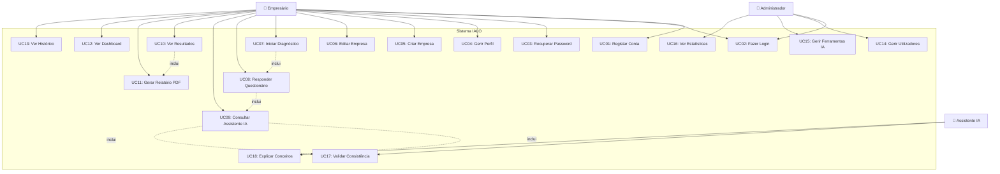

# Casos de Uso
## Ambiente Web para Framework IALO

**Projeto**: Ambiente Web para Framework IALO  
**Fase**: 1 — Levantamento e Modelação  
**Data**: 25/03/2026  

---

## 1. Atores do Sistema

| Ator | Descrição |
|------|-----------|
| **Empresário** | Utilizador principal. Dono ou gestor de uma MPE que realiza o diagnóstico IALO. |
| **Administrador** | Gestor do sistema. Pode gerir utilizadores, catálogo de ferramentas e ver estatísticas globais. |
| **Assistente IA** | Ator sistema. Agente conversacional que guia, explica e valida durante o questionário. |

---

## 2. Diagrama de Casos de Uso

---

## 3. Descrição dos Casos de Uso

### UC01 — Registar Conta

| Campo | Descrição |
|-------|-----------|
| **Ator Principal** | Empresário |
| **Pré-condições** | Nenhuma |
| **Fluxo Principal** | 1. Utilizador acede à página de registo → 2. Preenche nome, email, password → 3. Sistema valida dados e verifica unicidade do email → 4. Sistema cria conta → 5. Utilizador é redirecionado para login |
| **Fluxos Alternativos** | 3a. Email já existe → Mensagem de erro |
| **Pós-condições** | Conta criada, utilizador pode fazer login |

### UC02 — Fazer Login

| Campo | Descrição |
|-------|-----------|
| **Ator Principal** | Empresário / Administrador |
| **Pré-condições** | Conta existente e ativa |
| **Fluxo Principal** | 1. Utilizador insere email + password → 2. Sistema valida credenciais → 3. Sistema emite JWT token → 4. Utilizador acede ao painel principal |
| **Fluxos Alternativos** | 2a. Credenciais inválidas → Mensagem de erro → Max 5 tentativas |
| **Pós-condições** | Sessão autenticada com token JWT |

### UC03 — Recuperar Password

| Campo | Descrição |
|-------|-----------|
| **Ator Principal** | Empresário |
| **Pré-condições** | Conta existente |
| **Fluxo Principal** | 1. Utilizador clica "Esqueci password" → 2. Insere email → 3. Sistema envia link de reset → 4. Utilizador define nova password |
| **Pós-condições** | Password atualizada |

### UC04 — Gerir Perfil

| Campo | Descrição |
|-------|-----------|
| **Ator Principal** | Empresário |
| **Pré-condições** | Utilizador autenticado |
| **Fluxo Principal** | 1. Acede ao perfil → 2. Edita nome e/ou password → 3. Guarda alterações |
| **Pós-condições** | Dados atualizados |

### UC05 — Criar Empresa

| Campo | Descrição |
|-------|-----------|
| **Ator Principal** | Empresário |
| **Pré-condições** | Utilizador autenticado |
| **Fluxo Principal** | 1. Clica "Nova Empresa" → 2. Preenche: nome, setor, nº colaboradores, localização, ano fundação, descrição → 3. Sistema valida e cria perfil |
| **Pós-condições** | Empresa criada, pronta para diagnóstico |

### UC06 — Editar Empresa

| Campo | Descrição |
|-------|-----------|
| **Ator Principal** | Empresário |
| **Pré-condições** | Empresa existente, utilizador é o proprietário |
| **Fluxo Principal** | 1. Seleciona empresa → 2. Edita dados → 3. Guarda |
| **Pós-condições** | Dados da empresa atualizados |

### UC07 — Iniciar Diagnóstico

| Campo | Descrição |
|-------|-----------|
| **Ator Principal** | Empresário |
| **Pré-condições** | Empresa criada |
| **Fluxo Principal** | 1. Seleciona empresa → 2. Clica "Novo Diagnóstico" → 3. Sistema cria avaliação com estado 'em_curso' → 4. Redireciona para questionário (UC08) |
| **Pós-condições** | Avaliação criada, questionário iniciado |

### UC08 — Responder Questionário

| Campo | Descrição |
|-------|-----------|
| **Ator Principal** | Empresário |
| **Pré-condições** | Avaliação em curso |
| **Fluxo Principal** | 1. Sistema apresenta perguntas da dimensão atual → 2. Utilizador responde → 3. Sistema valida em tempo real → 4. Utilizador avança para próxima dimensão → 5. Repete para as 5 dimensões → 6. Utilizador submete questionário → 7. Sistema calcula scoring |
| **Fluxos Alternativos** | 2a. Utilizador solicita ajuda → UC09 / 4a. Utilizador guarda progresso e sai → Pode retomar mais tarde |
| **Pós-condições** | Respostas guardadas. Se completo, scoring calculado. |

### UC09 — Consultar Assistente IA

| Campo | Descrição |
|-------|-----------|
| **Ator Principal** | Empresário |
| **Pré-condições** | Questionário em curso |
| **Fluxo Principal** | 1. Utilizador abre chat lateral → 2. Escreve dúvida ou pede explicação → 3. Assistente IA responde com linguagem simples e exemplos do setor → 4. Utilizador pode continuar a conversa |
| **Inclui** | UC17 (Validar Consistência), UC18 (Explicar Conceitos) |
| **Pós-condições** | Conversa registada no histórico |

### UC10 — Ver Resultados

| Campo | Descrição |
|-------|-----------|
| **Ator Principal** | Empresário |
| **Pré-condições** | Avaliação concluída |
| **Fluxo Principal** | 1. Acede ao dashboard de resultados → 2. Vê gráfico radar, pontuações por dimensão, nível global → 3. Vê gaps identificados → 4. Vê recomendações |
| **Pós-condições** | Utilizador informado dos resultados |

### UC11 — Gerar Relatório PDF

| Campo | Descrição |
|-------|-----------|
| **Ator Principal** | Empresário |
| **Pré-condições** | Resultados calculados |
| **Fluxo Principal** | 1. Clica "Exportar PDF" → 2. Sistema gera PDF com pontos fortes, necessidades, recomendações → 3. PDF disponível para download |
| **Pós-condições** | Ficheiro PDF gerado e guardado |

### UC12 — Ver Dashboard

| Campo | Descrição |
|-------|-----------|
| **Ator Principal** | Empresário |
| **Pré-condições** | Utilizador autenticado |
| **Fluxo Principal** | Painel principal com: empresas do utilizador, avaliações recentes, resumo de resultados, acesso rápido a ações |
| **Pós-condições** | — |

### UC13 — Ver Histórico de Avaliações

| Campo | Descrição |
|-------|-----------|
| **Ator Principal** | Empresário |
| **Pré-condições** | Pelo menos uma avaliação realizada |
| **Fluxo Principal** | 1. Seleciona empresa → 2. Vê lista de avaliações com data e nível global → 3. Pode comparar evolução |
| **Pós-condições** | — |

### UC14 — Gerir Utilizadores (Admin)

| Campo | Descrição |
|-------|-----------|
| **Ator Principal** | Administrador |
| **Pré-condições** | Utilizador com role 'admin' |
| **Fluxo Principal** | Listar, ativar/desativar utilizadores |
| **Pós-condições** | Estado do utilizador atualizado |

### UC15 — Gerir Ferramentas IA (Admin)

| Campo | Descrição |
|-------|-----------|
| **Ator Principal** | Administrador |
| **Pré-condições** | Utilizador com role 'admin' |
| **Fluxo Principal** | CRUD do catálogo de ferramentas IA recomendáveis |
| **Pós-condições** | Catálogo atualizado |

### UC16 — Ver Estatísticas Globais (Admin)

| Campo | Descrição |
|-------|-----------|
| **Ator Principal** | Administrador |
| **Pré-condições** | Utilizador com role 'admin' |
| **Fluxo Principal** | Dashboard com métricas: nº utilizadores, nº avaliações, maturidade média por setor |
| **Pós-condições** | — |

### UC17 — Validar Consistência (Sistema)

| Campo | Descrição |
|-------|-----------|
| **Ator Principal** | Assistente IA |
| **Trigger** | Resposta do utilizador contradiz informação anterior |
| **Fluxo Principal** | 1. IA deteta contradição → 2. Gera alerta pedagógico → 3. Sugere revisão da resposta |
| **Pós-condições** | Utilizador alerta de inconsistência |

### UC18 — Explicar Conceitos (Sistema)

| Campo | Descrição |
|-------|-----------|
| **Ator Principal** | Assistente IA |
| **Trigger** | Utilizador pede explicação de termo técnico |
| **Fluxo Principal** | 1. IA identifica conceito → 2. Gera explicação com exemplo prático do setor da empresa → 3. Apresenta no chat |
| **Pós-condições** | Utilizador compreende o conceito |
