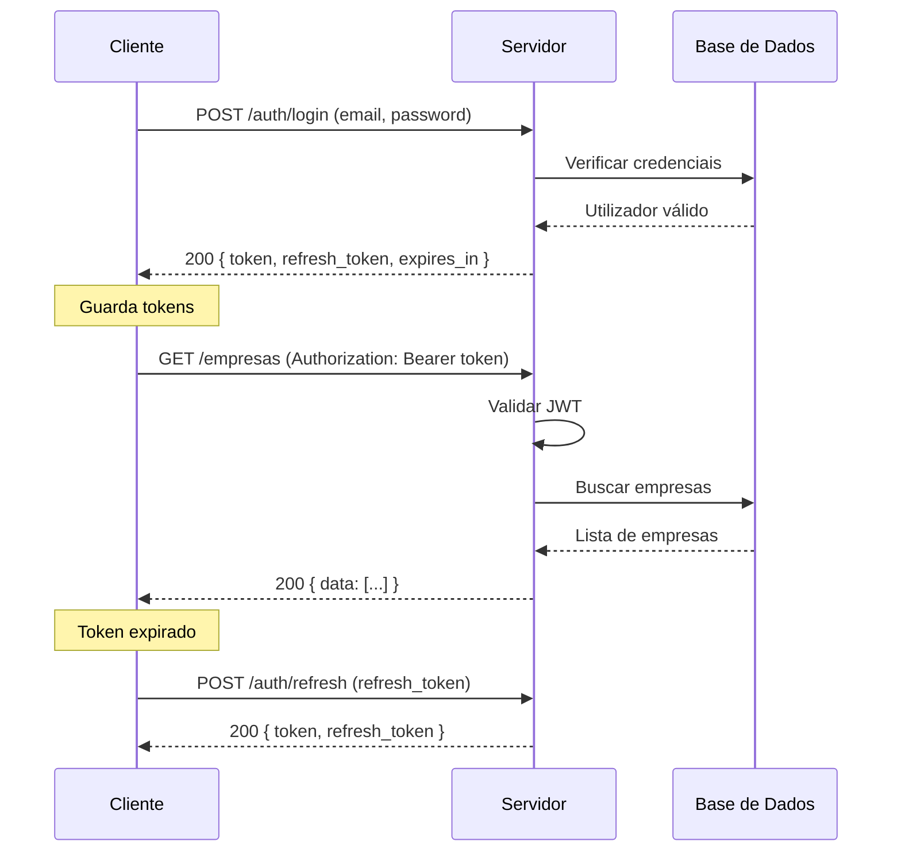

# Especificação da API RESTful
## Ambiente Web para Framework IALO

**Projeto**: Ambiente Web para Framework IALO  
**Fase**: 1 — Levantamento e Modelação  
**Data**: 25/03/2026  
**Base URL**: `/api/v1`  
**Autenticação**: JWT Bearer Token  

---

## 1. Visão Geral

A API segue os princípios REST com as seguintes convenções:
- **Formato**: JSON (request e response)
- **Autenticação**: JWT Bearer Token no header `Authorization`
- **Versionamento**: Prefixo `/api/v1/`
- **Paginação**: Query params `?page=1&per_page=20`
- **Códigos de estado**: Standard HTTP (200, 201, 400, 401, 403, 404, 500)

### Estrutura de Resposta Padrão

**Sucesso**:
```json
{
  "status": "success",
  "data": { ... },
  "message": "Operação realizada com sucesso"
}
```

**Erro**:
```json
{
  "status": "error",
  "error": {
    "code": "VALIDATION_ERROR",
    "message": "Email já registado",
    "details": [...]
  }
}
```

---

## 2. Endpoints

### 2.1. Autenticação (`/api/v1/auth`)

#### POST `/auth/register` — Registo de utilizador
**Acesso**: Público

| Request Body | Tipo | Obrigatório | Descrição |
|-------------|------|-------------|-----------|
| nome | string | ✅ | Nome completo |
| email | string | ✅ | Email válido e único |
| password | string | ✅ | Min. 8 caracteres |

**Response (201)**:
```json
{
  "status": "success",
  "data": {
    "id": 1,
    "nome": "João Silva",
    "email": "joao@empresa.pt",
    "role": "empresario",
    "criado_em": "2026-03-25T10:00:00Z"
  }
}
```

#### POST `/auth/login` — Login
**Acesso**: Público

| Request Body | Tipo | Obrigatório |
|-------------|------|-------------|
| email | string | ✅ |
| password | string | ✅ |

**Response (200)**:
```json
{
  "status": "success",
  "data": {
    "token": "eyJhbGciOiJIUzI1NiIs...",
    "refresh_token": "dGhpcyBpcyBh...",
    "expires_in": 3600,
    "user": {
      "id": 1,
      "nome": "João Silva",
      "email": "joao@empresa.pt",
      "role": "empresario"
    }
  }
}
```

#### POST `/auth/refresh` — Renovar token
**Acesso**: Autenticado

| Request Body | Tipo | Obrigatório |
|-------------|------|-------------|
| refresh_token | string | ✅ |

#### POST `/auth/password-reset` — Solicitar reset de password
**Acesso**: Público

| Request Body | Tipo | Obrigatório |
|-------------|------|-------------|
| email | string | ✅ |

---

### 2.2. Utilizadores (`/api/v1/users`)

#### GET `/users/me` — Perfil do utilizador atual
**Acesso**: Autenticado

#### PUT `/users/me` — Atualizar perfil
**Acesso**: Autenticado

| Request Body | Tipo | Obrigatório |
|-------------|------|-------------|
| nome | string | ❌ |
| password | string | ❌ |

#### GET `/users` — Listar utilizadores
**Acesso**: Admin

#### PUT `/users/:id/status` — Ativar/desativar utilizador
**Acesso**: Admin

| Request Body | Tipo | Obrigatório |
|-------------|------|-------------|
| ativo | boolean | ✅ |

---

### 2.3. Empresas (`/api/v1/empresas`)

#### POST `/empresas` — Criar empresa
**Acesso**: Autenticado

| Request Body | Tipo | Obrigatório | Descrição |
|-------------|------|-------------|-----------|
| nome | string | ✅ | Nome da empresa |
| setor | string | ✅ | Setor de atividade |
| num_colaboradores | integer | ❌ | Nº colaboradores |
| localizacao | string | ❌ | Localização |
| ano_fundacao | integer | ❌ | Ano de fundação |
| descricao | string | ❌ | Descrição do negócio |

**Response (201)**:
```json
{
  "status": "success",
  "data": {
    "id": 1,
    "nome": "Loja do João",
    "setor": "retalho",
    "num_colaboradores": 5,
    "localizacao": "Lisboa",
    "ano_fundacao": 2015,
    "descricao": "Loja de roupa no centro de Lisboa",
    "criado_em": "2026-03-25T10:30:00Z"
  }
}
```

#### GET `/empresas` — Listar empresas do utilizador
**Acesso**: Autenticado (vê apenas as suas)

#### GET `/empresas/:id` — Detalhes de uma empresa
**Acesso**: Autenticado (proprietário) ou Admin

#### PUT `/empresas/:id` — Atualizar empresa
**Acesso**: Autenticado (proprietário)

#### DELETE `/empresas/:id` — Eliminar empresa (soft delete)
**Acesso**: Autenticado (proprietário)

---

### 2.4. Avaliações (`/api/v1/avaliacoes`)

#### POST `/avaliacoes` — Iniciar nova avaliação
**Acesso**: Autenticado

| Request Body | Tipo | Obrigatório |
|-------------|------|-------------|
| empresa_id | integer | ✅ |

**Response (201)**:
```json
{
  "status": "success",
  "data": {
    "id": 1,
    "empresa_id": 1,
    "estado": "em_curso",
    "iniciado_em": "2026-03-25T11:00:00Z"
  }
}
```

#### GET `/avaliacoes` — Listar avaliações
**Acesso**: Autenticado  
**Query params**: `?empresa_id=1&estado=em_curso`

#### GET `/avaliacoes/:id` — Detalhes de avaliação
**Acesso**: Autenticado (proprietário)

**Response (200)**:
```json
{
  "status": "success",
  "data": {
    "id": 1,
    "empresa_id": 1,
    "estado": "concluida",
    "pontuacao_global": 54.5,
    "nivel_global": 3,
    "resultados_dimensao": [
      { "dimensao": "DADOS", "pontuacao": 56.0, "nivel": 3, "gap_critico": false },
      { "dimensao": "INFRA", "pontuacao": 40.0, "nivel": 2, "gap_critico": true },
      { "dimensao": "COMP", "pontuacao": 68.0, "nivel": 4, "gap_critico": false },
      { "dimensao": "ESTR", "pontuacao": 44.0, "nivel": 3, "gap_critico": false },
      { "dimensao": "CULT", "pontuacao": 60.0, "nivel": 3, "gap_critico": false }
    ],
    "iniciado_em": "2026-03-25T11:00:00Z",
    "concluido_em": "2026-03-25T11:45:00Z"
  }
}
```

#### POST `/avaliacoes/:id/concluir` — Finalizar avaliação e calcular scoring
**Acesso**: Autenticado (proprietário)

#### DELETE `/avaliacoes/:id` — Cancelar avaliação em curso
**Acesso**: Autenticado (proprietário)

---

### 2.5. Questionário (`/api/v1/questionario`)

#### GET `/questionario/dimensoes` — Listar dimensões e perguntas
**Acesso**: Autenticado

**Response (200)**:
```json
{
  "status": "success",
  "data": [
    {
      "id": 1,
      "codigo": "DADOS",
      "nome": "Dados",
      "peso": 0.25,
      "indicadores": [
        {
          "id": 1,
          "codigo": "D1",
          "nome": "Recolha de Dados",
          "perguntas": [
            {
              "id": 1,
              "texto": "Como regista as vendas e transações da sua empresa?",
              "tipo_resposta": "escolha_multipla",
              "opcoes": ["Caderno/papel", "Excel/folha de cálculo", "Software dedicado", "ERP integrado"],
              "obrigatoria": true,
              "ajuda_contextual": "Pense no método que usa no dia-a-dia..."
            }
          ]
        }
      ]
    }
  ]
}
```

#### POST `/questionario/respostas` — Guardar respostas (batch)
**Acesso**: Autenticado

| Request Body | Tipo | Obrigatório |
|-------------|------|-------------|
| avaliacao_id | integer | ✅ |
| respostas | array | ✅ |
| respostas[].pergunta_id | integer | ✅ |
| respostas[].valor_texto | string | ❌ |
| respostas[].valor_numerico | float | ❌ |

**Response (200)**:
```json
{
  "status": "success",
  "data": {
    "guardadas": 5,
    "progresso": {
      "total_perguntas": 25,
      "respondidas": 10,
      "percentagem": 40
    }
  }
}
```

#### GET `/questionario/respostas/:avaliacao_id` — Obter respostas guardadas
**Acesso**: Autenticado (proprietário)

#### GET `/questionario/progresso/:avaliacao_id` — Ver progresso
**Acesso**: Autenticado (proprietário)

---

### 2.6. Scoring (`/api/v1/scoring`)

#### GET `/scoring/:avaliacao_id` — Obter resultados de scoring
**Acesso**: Autenticado (proprietário)

**Response (200)**:
```json
{
  "status": "success",
  "data": {
    "avaliacao_id": 1,
    "pontuacao_global": 54.5,
    "nivel_global": 3,
    "nivel_descricao": "Definido",
    "dimensoes": [
      {
        "codigo": "DADOS",
        "nome": "Dados",
        "pontuacao": 56.0,
        "nivel": 3,
        "gap_critico": false,
        "indicadores": [
          { "codigo": "D1", "nome": "Recolha de Dados", "pontuacao": 3 },
          { "codigo": "D2", "nome": "Armazenamento Digital", "pontuacao": 2 },
          { "codigo": "D3", "nome": "Qualidade e Organização", "pontuacao": 4 },
          { "codigo": "D4", "nome": "Utilização para Decisão", "pontuacao": 3 },
          { "codigo": "D5", "nome": "Segurança e Privacidade", "pontuacao": 2 }
        ]
      }
    ],
    "gaps_criticos": [
      { "dimensao": "Infraestrutura", "pontuacao": 40.0, "acao_sugerida": "Investir em digitalização básica" }
    ]
  }
}
```

---

### 2.7. Relatórios (`/api/v1/relatorios`)

#### POST `/relatorios` — Gerar relatório
**Acesso**: Autenticado

| Request Body | Tipo | Obrigatório |
|-------------|------|-------------|
| avaliacao_id | integer | ✅ |

#### GET `/relatorios/:id` — Obter relatório
**Acesso**: Autenticado (proprietário)

#### GET `/relatorios/:id/pdf` — Download PDF
**Acesso**: Autenticado (proprietário)  
**Response**: Ficheiro PDF (Content-Type: application/pdf)

#### GET `/relatorios?empresa_id=1` — Listar relatórios de uma empresa
**Acesso**: Autenticado (proprietário)

---

### 2.8. Assistente IA (`/api/v1/assistente`)

#### POST `/assistente/mensagem` — Enviar mensagem ao assistente
**Acesso**: Autenticado

| Request Body | Tipo | Obrigatório | Descrição |
|-------------|------|-------------|-----------|
| avaliacao_id | integer | ✅ | Contexto da avaliação |
| mensagem | string | ✅ | Mensagem do utilizador |
| pergunta_atual_id | integer | ❌ | ID da pergunta em contexto |

**Response (200)**:
```json
{
  "status": "success",
  "data": {
    "resposta": "Dados estruturados são informações organizadas de forma regular...",
    "alertas_consistencia": [],
    "sugestao_resposta": null
  }
}
```

#### GET `/assistente/historico/:avaliacao_id` — Histórico de conversa
**Acesso**: Autenticado (proprietário)

---

### 2.9. Ferramentas IA (`/api/v1/ferramentas`)

#### GET `/ferramentas` — Listar ferramentas
**Acesso**: Autenticado  
**Query params**: `?categoria=atendimento&custo=gratuito`

#### GET `/ferramentas/:id` — Detalhes de ferramenta
**Acesso**: Autenticado

#### POST `/ferramentas` — Criar ferramenta
**Acesso**: Admin

#### PUT `/ferramentas/:id` — Atualizar ferramenta
**Acesso**: Admin

#### DELETE `/ferramentas/:id` — Eliminar ferramenta
**Acesso**: Admin

---

## 3. Autenticação e Segurança

### 3.1. Fluxo JWT



### 3.2. Headers Obrigatórios

| Header | Valor | Requerido em |
|--------|-------|-------------|
| `Authorization` | `Bearer <token>` | Endpoints protegidos |
| `Content-Type` | `application/json` | POST, PUT com body |

### 3.3. Códigos de Erro

| Código | Significado | Quando |
|--------|-------------|--------|
| 400 | Bad Request | Validação falhou |
| 401 | Unauthorized | Token inválido ou ausente |
| 403 | Forbidden | Sem permissão (ex.: aceder empresa de outro utilizador) |
| 404 | Not Found | Recurso não existe |
| 409 | Conflict | Duplicado (ex.: email já registado) |
| 429 | Too Many Requests | Rate limit excedido |
| 500 | Internal Server Error | Erro do servidor |
