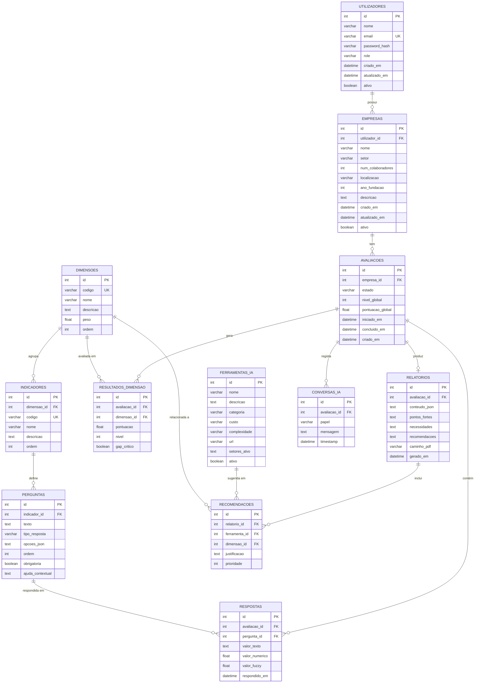

# Modelo de Dados
## Ambiente Web para Framework IALO

**Projeto**: Ambiente Web para Framework IALO  
**Fase**: 1 — Levantamento e Modelação  
**Data**: 25/03/2026  

---

## 1. Diagrama Entidade-Relacionamento

---

## 2. Dicionário de Dados

### 2.1. `utilizadores` — Utilizadores do sistema

| Coluna | Tipo | Constraints | Descrição |
|--------|------|-------------|-----------|
| id | INTEGER | PK, AUTO_INCREMENT | Identificador único |
| nome | VARCHAR(100) | NOT NULL | Nome completo |
| email | VARCHAR(255) | NOT NULL, UNIQUE | Email (usado para login) |
| password_hash | VARCHAR(255) | NOT NULL | Hash da password (bcrypt/argon2) |
| role | VARCHAR(20) | NOT NULL, DEFAULT 'empresario' | Papel: 'empresario' ou 'admin' |
| criado_em | DATETIME | NOT NULL, DEFAULT NOW | Data de registo |
| atualizado_em | DATETIME | | Última atualização |
| ativo | BOOLEAN | NOT NULL, DEFAULT TRUE | Conta ativa ou desativada |

---

### 2.2. `empresas` — Perfis de empresas avaliadas

| Coluna | Tipo | Constraints | Descrição |
|--------|------|-------------|-----------|
| id | INTEGER | PK, AUTO_INCREMENT | Identificador único |
| utilizador_id | INTEGER | FK → utilizadores.id, NOT NULL | Proprietário da empresa |
| nome | VARCHAR(200) | NOT NULL | Nome da empresa |
| setor | VARCHAR(100) | NOT NULL | Setor de atividade (retalho, restauração, serviços, etc.) |
| num_colaboradores | INTEGER | | Número de colaboradores |
| localizacao | VARCHAR(200) | | Localização (distrito/cidade) |
| ano_fundacao | INTEGER | | Ano de fundação |
| descricao | TEXT | | Descrição livre do negócio |
| criado_em | DATETIME | NOT NULL, DEFAULT NOW | Data de criação |
| atualizado_em | DATETIME | | Última atualização |
| ativo | BOOLEAN | NOT NULL, DEFAULT TRUE | Ativo ou eliminado (soft delete) |

---

### 2.3. `avaliacoes` — Sessões de diagnóstico IALO

| Coluna | Tipo | Constraints | Descrição |
|--------|------|-------------|-----------|
| id | INTEGER | PK, AUTO_INCREMENT | Identificador único |
| empresa_id | INTEGER | FK → empresas.id, NOT NULL | Empresa avaliada |
| estado | VARCHAR(20) | NOT NULL, DEFAULT 'em_curso' | Estado: 'em_curso', 'concluida', 'cancelada' |
| nivel_global | INTEGER | | Nível global de maturidade (1-5), preenchido após conclusão |
| pontuacao_global | FLOAT | | Pontuação global em percentagem (0-100), preenchida após conclusão |
| iniciado_em | DATETIME | NOT NULL, DEFAULT NOW | Início da avaliação |
| concluido_em | DATETIME | | Data de conclusão |
| criado_em | DATETIME | NOT NULL, DEFAULT NOW | Data de criação do registo |

---

### 2.4. `dimensoes` — Dimensões do Framework IALO (dados de referência)

| Coluna | Tipo | Constraints | Descrição |
|--------|------|-------------|-----------|
| id | INTEGER | PK, AUTO_INCREMENT | Identificador único |
| codigo | VARCHAR(10) | NOT NULL, UNIQUE | Código curto (ex.: 'DADOS', 'INFRA', 'COMP', 'ESTR', 'CULT') |
| nome | VARCHAR(50) | NOT NULL | Nome completo (ex.: 'Dados', 'Infraestrutura') |
| descricao | TEXT | | Descrição da dimensão |
| peso | FLOAT | NOT NULL | Peso na pontuação global (ex.: 0.25 para 25%) |
| ordem | INTEGER | NOT NULL | Ordem de apresentação no questionário |

**Seed data**:
| codigo | nome | peso | ordem |
|--------|------|------|-------|
| DADOS | Dados | 0.25 | 1 |
| INFRA | Infraestrutura | 0.20 | 2 |
| COMP | Competências | 0.20 | 3 |
| ESTR | Estratégia | 0.20 | 4 |
| CULT | Cultura | 0.15 | 5 |

---

### 2.5. `indicadores` — Indicadores de cada dimensão

| Coluna | Tipo | Constraints | Descrição |
|--------|------|-------------|-----------|
| id | INTEGER | PK, AUTO_INCREMENT | Identificador único |
| dimensao_id | INTEGER | FK → dimensoes.id, NOT NULL | Dimensão a que pertence |
| codigo | VARCHAR(10) | NOT NULL, UNIQUE | Código curto (ex.: 'D1', 'I3', 'CU5') |
| nome | VARCHAR(100) | NOT NULL | Nome do indicador |
| descricao | TEXT | | Descrição detalhada |
| ordem | INTEGER | NOT NULL | Ordem de apresentação |

---

### 2.6. `perguntas` — Perguntas do questionário

| Coluna | Tipo | Constraints | Descrição |
|--------|------|-------------|-----------|
| id | INTEGER | PK, AUTO_INCREMENT | Identificador único |
| indicador_id | INTEGER | FK → indicadores.id, NOT NULL | Indicador avaliado por esta pergunta |
| texto | TEXT | NOT NULL | Texto da pergunta |
| tipo_resposta | VARCHAR(30) | NOT NULL | Tipo: 'escala_1_5', 'escolha_multipla', 'sim_nao', 'texto_livre' |
| opcoes_json | TEXT | | Opções de resposta em JSON (para escolha múltipla) |
| ordem | INTEGER | NOT NULL | Ordem dentro do indicador |
| obrigatoria | BOOLEAN | NOT NULL, DEFAULT TRUE | Se a resposta é obrigatória |
| ajuda_contextual | TEXT | | Texto de ajuda / exemplo para o utilizador |

---

### 2.7. `respostas` — Respostas do utilizador ao questionário

| Coluna | Tipo | Constraints | Descrição |
|--------|------|-------------|-----------|
| id | INTEGER | PK, AUTO_INCREMENT | Identificador único |
| avaliacao_id | INTEGER | FK → avaliacoes.id, NOT NULL | Avaliação correspondente |
| pergunta_id | INTEGER | FK → perguntas.id, NOT NULL | Pergunta respondida |
| valor_texto | TEXT | | Resposta em texto (para perguntas de texto livre) |
| valor_numerico | FLOAT | | Valor numérico da resposta (1-5 para escalas) |
| valor_fuzzy | FLOAT | | Valor convertido por lógica fuzzy (para respostas qualitativas) |
| respondido_em | DATETIME | NOT NULL, DEFAULT NOW | Timestamp da resposta |

**Unique constraint**: (avaliacao_id, pergunta_id) — uma resposta por pergunta por avaliação.

---

### 2.8. `resultados_dimensao` — Resultados calculados por dimensão

| Coluna | Tipo | Constraints | Descrição |
|--------|------|-------------|-----------|
| id | INTEGER | PK, AUTO_INCREMENT | Identificador único |
| avaliacao_id | INTEGER | FK → avaliacoes.id, NOT NULL | Avaliação correspondente |
| dimensao_id | INTEGER | FK → dimensoes.id, NOT NULL | Dimensão avaliada |
| pontuacao | FLOAT | NOT NULL | Pontuação em % (0-100) |
| nivel | INTEGER | NOT NULL | Nível de maturidade (1-5) |
| gap_critico | BOOLEAN | NOT NULL, DEFAULT FALSE | Se é um gap crítico (pontuação ≤ 40%) |

**Unique constraint**: (avaliacao_id, dimensao_id)

---

### 2.9. `relatorios` — Relatórios gerados

| Coluna | Tipo | Constraints | Descrição |
|--------|------|-------------|-----------|
| id | INTEGER | PK, AUTO_INCREMENT | Identificador único |
| avaliacao_id | INTEGER | FK → avaliacoes.id, NOT NULL, UNIQUE | Avaliação correspondente (1 relatório por avaliação) |
| conteudo_json | TEXT | | Conteúdo completo do relatório em JSON |
| pontos_fortes | TEXT | | Texto dos pontos fortes identificados |
| necessidades | TEXT | | Texto das necessidades e gaps |
| recomendacoes | TEXT | | Texto das recomendações gerais |
| caminho_pdf | VARCHAR(500) | | Caminho do ficheiro PDF gerado |
| gerado_em | DATETIME | NOT NULL, DEFAULT NOW | Data de geração |

---

### 2.10. `ferramentas_ia` — Catálogo de ferramentas IA recomendáveis

| Coluna | Tipo | Constraints | Descrição |
|--------|------|-------------|-----------|
| id | INTEGER | PK, AUTO_INCREMENT | Identificador único |
| nome | VARCHAR(100) | NOT NULL | Nome da ferramenta (ex.: ChatGPT, Notion AI) |
| descricao | TEXT | | O que faz e como pode ajudar uma MPE |
| categoria | VARCHAR(50) | NOT NULL | Categoria: 'atendimento', 'gestao', 'marketing', 'operacoes', 'dados', 'automacao' |
| custo | VARCHAR(30) | NOT NULL | 'gratuito', 'freemium', 'baixo_custo', 'pago' |
| complexidade | VARCHAR(30) | NOT NULL | 'muito_facil', 'facil', 'medio', 'avancado' |
| url | VARCHAR(500) | | URL do website da ferramenta |
| setores_alvo | TEXT | | Setores onde é mais útil (JSON array) |
| ativo | BOOLEAN | NOT NULL, DEFAULT TRUE | Se está ativa no catálogo |

---

### 2.11. `recomendacoes` — Recomendações feitas em relatórios

| Coluna | Tipo | Constraints | Descrição |
|--------|------|-------------|-----------|
| id | INTEGER | PK, AUTO_INCREMENT | Identificador único |
| relatorio_id | INTEGER | FK → relatorios.id, NOT NULL | Relatório onde consta |
| ferramenta_id | INTEGER | FK → ferramentas_ia.id | Ferramenta recomendada (pode ser NULL se é recomendação genérica) |
| dimensao_id | INTEGER | FK → dimensoes.id | Dimensão a que se refere |
| justificacao | TEXT | NOT NULL | Porquê esta recomendação para esta empresa |
| prioridade | INTEGER | NOT NULL | 1 = mais prioritária |

---

### 2.12. `conversas_ia` — Histórico de conversas com o assistente IA

| Coluna | Tipo | Constraints | Descrição |
|--------|------|-------------|-----------|
| id | INTEGER | PK, AUTO_INCREMENT | Identificador único |
| avaliacao_id | INTEGER | FK → avaliacoes.id, NOT NULL | Avaliação em contexto |
| papel | VARCHAR(20) | NOT NULL | 'utilizador' ou 'assistente' |
| mensagem | TEXT | NOT NULL | Conteúdo da mensagem |
| timestamp | DATETIME | NOT NULL, DEFAULT NOW | Momento da mensagem |

---

## 3. Índices Recomendados

| Tabela | Colunas | Tipo | Justificação |
|--------|---------|------|-------------|
| utilizadores | email | UNIQUE | Pesquisa por email no login |
| empresas | utilizador_id | INDEX | Listar empresas de um utilizador |
| avaliacoes | empresa_id | INDEX | Listar avaliações de uma empresa |
| avaliacoes | estado | INDEX | Filtrar avaliações por estado |
| respostas | (avaliacao_id, pergunta_id) | UNIQUE | Garantir uma resposta por pergunta |
| resultados_dimensao | (avaliacao_id, dimensao_id) | UNIQUE | Um resultado por dimensão por avaliação |
| indicadores | dimensao_id | INDEX | Listar indicadores de uma dimensão |
| perguntas | indicador_id | INDEX | Listar perguntas de um indicador |
| conversas_ia | avaliacao_id | INDEX | Carregar conversa de uma avaliação |

---

## 4. Notas de Implementação

- **Soft delete**: Empresas e utilizadores usam flag `ativo` em vez de DELETE físico
- **Timestamps**: Todas as tabelas devem ter `criado_em` e, quando aplicável, `atualizado_em`
- **JSON fields**: `opcoes_json`, `conteudo_json` e `setores_alvo` armazenam JSON como texto. Dependendo do SGBD, podem usar tipo JSON nativo
- **Cascading**: DELETE de empresa faz cascade para avaliações → respostas, resultados, relatórios, conversas
- **Seed data**: As tabelas `dimensoes`, `indicadores`, `perguntas` e `ferramentas_ia` são populadas com dados iniciais via migration/seed
